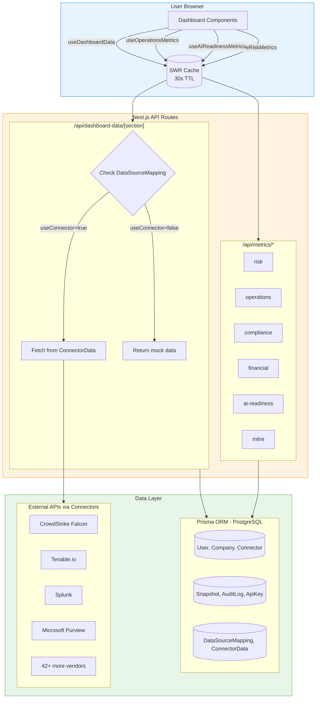
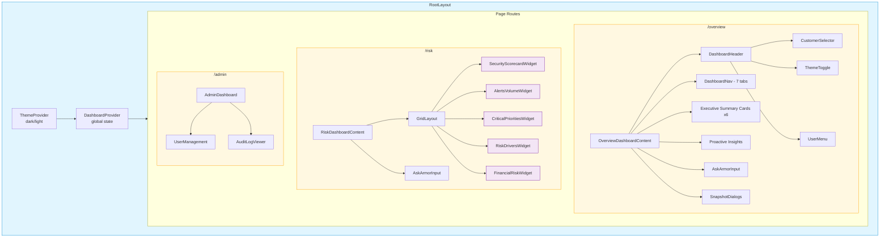
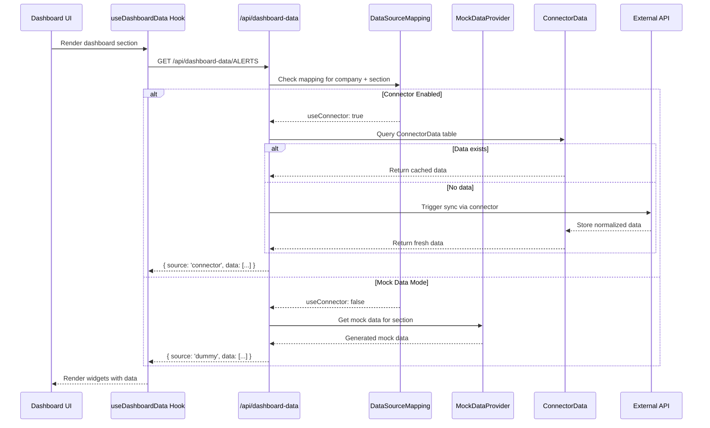

# Armor-Dash POC Productionalization Requirements

## Executive Summary

This document consolidates the complete code interrogation of the Armor-Dash POC, providing the definitive requirements for productionalization. The analysis covers structure, mock data, component hierarchy, connectors, and data fetching patterns.

**POC Status**: Production-ready architecture with demo data that must be replaced with real integrations.

---

## 1. Codebase Overview

### Technology Stack

| Layer | Technology | Version |
|-------|------------|---------|
| Framework | Next.js | 15.5.9 |
| UI Library | React | 19.2.3 |
| Language | TypeScript | 5.x |
| Styling | Tailwind CSS | 3.4.19 |
| Database | PostgreSQL | via Supabase |
| ORM | Prisma | 5.22.0 |
| Authentication | Supabase Auth | 2.89.0 |
| Charts | Recharts | 3.6.0 |
| Data Fetching | SWR | 2.3.8 |
| Email | Resend | 4.0.3 |

### File Inventory

| Type | Count | Purpose |
|------|-------|---------|
| `.tsx` | 111 | React components |
| `.ts` | 119 | Utilities, services, API routes |
| API Routes | 40 | Backend endpoints |
| Database Models | 12 | Prisma schema |
| Widget Types | 9 | Dashboard widgets |
| Connector Types | 46 | Data integrations |
| Dashboard Types | 7 | Dashboard views |
| **Total Source** | **235** | Application code |

---

## 2. Critical Mock Data (MUST REPLACE)

### Priority 1: Core Mock Data Files

#### File: `lib/mock-data.ts` (643 lines)
**Location**: `/Users/phillipboles/Development/UI/UI-Uplift/submodules/armor-dash/lib/mock-data.ts`

**Contains**:
- 3 mock customers (Acme, Global Healthcare, TechStart)
- 1000+ pre-generated security alerts
- 200+ fake vulnerabilities with CVE IDs
- 100+ fake control statuses
- 500+ fake incidents with MTTA/MTTR metrics
- Service metrics with target vs actual values

**Replacement Required**:
| Data Type | Real Source |
|-----------|-------------|
| Alerts | Armor Nexus, CrowdStrike, Sentinel |
| Vulnerabilities | Tenable, Qualys, Rapid7 |
| Controls | Drata, Vanta, Purview |
| Incidents | Splunk, QRadar, ServiceNow |
| Service Metrics | Actual SLA calculations |

---

#### File: `prisma/seed.ts` (408 lines)
**Location**: `/Users/phillipboles/Development/UI/UI-Uplift/submodules/armor-dash/prisma/seed.ts`

**CRITICAL SECURITY ISSUE**:
```typescript
// Line 26 - Hardcoded password
const DEMO_PASSWORD = 'Armor@2025!'

// Demo accounts:
- chris.drake@armor.com (SUPER_ADMIN)
- test@armor.com (SUPER_ADMIN)
- admin@armor.com (ADMIN)
```

**Action Required**:
1. Remove hardcoded password immediately
2. Remove all demo/test user accounts
3. Implement proper account provisioning workflow
4. Never log passwords to console (line 258)

---

#### File: `lib/data-governance-mock.ts` (569 lines)
**Location**: `/Users/phillipboles/Development/UI/UI-Uplift/submodules/armor-dash/lib/data-governance-mock.ts`

**Contains**:
- 500+ mock data items per customer
- Sensitivity labels (Public → Restricted)
- AI readiness scores (fake)
- DLP incidents (fake)
- Policy coverage metrics

**Replacement Required**:
- Integrate with Microsoft Purview
- Connect to Google Cloud DLP
- Implement AWS Macie connector
- Pull from actual compliance platforms

---

### Priority 2: Connector Stub Data

#### File: `lib/connectors/armor-nexus-connector.ts` (472 lines)
**Lines 317-418**: Stub data generators

```typescript
generateStubAlerts()        // 100 fake alerts
generateStubVulnerabilities() // 100 fake vulns
generateStubControls()       // 50 fake controls
generateStubServiceMetrics() // 20 fake metrics
```

**Comment**: "For now, return stub data (Milestone 2 will implement real API calls)"

---

## 3. Component Architecture

### Dashboard Content Components (Container Pattern)

```
Dashboard Content Components (7 types):
├── OverviewDashboardContent (650+ lines)
│   └── Uses: useOverviewMetrics() - aggregates all 6 metric types
├── RiskDashboardContent
│   └── Uses: useRiskMetrics()
├── AIGovernanceContent
│   └── Uses: useAIReadinessMetrics()
├── OperationsDashboardContent
│   └── Uses: useOperationsMetrics()
├── ControlsDashboardContent
│   └── Uses: useComplianceMetrics()
├── MITRECoverageContent
│   └── Uses: useMITREMetrics()
└── FinancialImpactContent
    └── Uses: useFinancialMetrics()
```

### Widget System (9 Types)

| Widget | Purpose | Data Source |
|--------|---------|-------------|
| SecurityScorecardWidget | A-F grades | Risk calculations |
| AlertsVolumeWidget | Stacked chart | useAlerts() |
| RiskDriversWidget | Top 5 contributors | Risk metrics |
| CriticalPrioritiesWidget | Actionable gaps | MITRE data |
| FinancialRiskWidget | FAIR ALE | Financial calculations |
| VulnerabilityWidget | Donut chart | useVulnerabilities() |
| ControlCoverageWidget | Status breakdown | useControls() |
| ServiceDeliveryWidget | SLA metrics | Service data |
| RiskScoreWidget | Legacy | Deprecated |

### Base UI Components (8 Core)

- Button (variants: default, secondary, outline, ghost, destructive)
- Card (header, content, footer)
- Dialog (accessible modal)
- Input (text, email, password, number)
- Slider (range selector)
- InfoTooltip (help text)
- LiveDataIndicator (refresh status)
- SectionExportMenu (PNG/CSV export)

---

## 4. Connector Implementation Status

### Total: 46 Connectors

| Status | Count | Description |
|--------|-------|-------------|
| **Complete** | 12 | Production-ready |
| **Partial** | 20 | Need testing/refinement |
| **Stub** | 6 | Placeholder only |
| **Generic Base** | 8 | Abstract classes |

### Fully Complete (Production Ready)

1. `crowdstrike-connector.ts` (414 lines) - OAuth2, token caching
2. `tenable-connector.ts` (541 lines) - Async export polling
3. `splunk-connector.ts` (439 lines) - Search job polling
4. `purview-connector.ts` (480 lines) - Dual OAuth2 tokens
5. `servicenow-connector.ts` (578 lines) - ITSM table queries
6. `wiz-connector.ts` (580 lines) - Cloud security
7. `drata-connector.ts` - GRC compliance
8. `vanta-connector.ts` - GRC compliance
9. `qradar-connector.ts` - SIEM queries
10. `chronicle-connector.ts` (406 lines) - Google SIEM
11. `custom-api-connector.ts` - Generic REST/GraphQL
12. `mdr-alerts-connector.ts` - Armor internal

### Missing Implementations (CRITICAL)

| Connector | Issue | Fix Required |
|-----------|-------|--------------|
| AWS Security | Request signing (Sig V4) | Implement `aws4fetch` |
| GCP SCC | JWT signing | Add Google Cloud JWT |
| Oracle Cloud | OCI signature | Implement OCI signing |
| Chronicle | JWT assertion | Add JWT library |
| Armor Nexus | Stub data | Replace with real API |

---

## 5. API & Data Fetching

### Data Fetching Strategy

| Pattern | Library | Use Case |
|---------|---------|----------|
| SWR Hooks | SWR 2.3.8 | Dashboard metrics (30s refresh) |
| Direct fetch() | Native | Mutations (POST/PUT/DELETE) |
| useDashboardData | Custom | Generic section data |

### SWR Configuration

```typescript
const swrConfig = {
  refreshInterval: 30000,       // 30 second auto-refresh
  revalidateOnFocus: true,      // Refresh on tab focus
  dedupingInterval: 10000,      // Dedupe within 10s
  errorRetryCount: 2,           // 2 retry attempts
  keepPreviousData: true,       // Show stale during refresh
};
```

### API Endpoints (40 Total)

| Category | Count | Examples |
|----------|-------|----------|
| Authentication | 4 | /api/auth/login, /register, /logout, /session |
| Metrics | 6 | /api/metrics/risk, /operations, /compliance |
| Connectors | 5 | /api/connectors, /test, /sync, /preview |
| Settings | 5 | /api/settings/profile, /password, /email-reports |
| Snapshots | 3 | /api/snapshots (CRUD) |
| Admin | 7 | /api/admin/users, /audit-logs, /stats |
| Dashboard Data | 2 | /api/dashboard-data/[section] |
| Export | 1 | /api/export/pdf |
| AI | 1 | /api/ask (Ask Armor) |

### Missing: Pagination

**Current State**: All endpoints return full datasets
**Required**: Implement cursor-based pagination for:
- Alerts (can be 1000+)
- Vulnerabilities (can be 200+)
- Audit logs (grows over time)
- Snapshots (user-generated)

---

## 6. Security Considerations

### Authentication Architecture

| Layer | Implementation |
|-------|---------------|
| Provider | Supabase Auth |
| Session | JWT in HttpOnly cookies |
| Password | bcryptjs hashing |
| CAPTCHA | Turnstile verification |
| OAuth2 | Prepared (not active) |

### Authorization Model

```
User Types:
├── ARMOR_USER - Internal (sees all companies)
└── COMPANY_USER - External (sees own company)

System Roles:
├── SUPER_ADMIN - Global admin
├── ADMIN - Company admin
└── USER - Read-only

Company Roles:
├── CEO, CFO, CIO, CISO, CTO
├── IT_DIRECTOR, BOARD_MEMBER
└── OTHER
```

### Encryption

| Data | Algorithm | Key Source |
|------|-----------|------------|
| Connector credentials | AES-256-GCM | ENCRYPTION_KEY env var |
| Auth tag | 16-byte | Per encryption |
| IV | 16-byte random | Per encryption |

### Security Headers (Implemented)

```
Strict-Transport-Security  → 2 year HSTS
X-Frame-Options            → SAMEORIGIN
X-Content-Type-Options     → nosniff
X-XSS-Protection           → 1; mode=block
Referrer-Policy            → origin-when-cross-origin
```

---

## 7. Productionalization Checklist

### Phase 1: Security (BLOCKING)

- [ ] Remove hardcoded password `Armor@2025!`
- [ ] Delete all demo user accounts from seed.ts
- [ ] Rotate any exposed credentials
- [ ] Implement proper account provisioning
- [ ] Add rate limiting on public endpoints

### Phase 2: Data Integration (CRITICAL)

- [ ] Replace `mock-data.ts` with data provider routing
- [ ] Replace `data-governance-mock.ts` with Purview/DLP
- [ ] Implement Armor Nexus real API calls
- [ ] Complete AWS Security Hub connector (Sig V4)
- [ ] Complete GCP SCC connector (JWT signing)
- [ ] Complete Oracle Cloud connector (OCI signing)
- [ ] Test all 12 "complete" connectors in production

### Phase 3: Infrastructure (REQUIRED)

- [ ] Implement background job queue (Bull or Temporal)
- [ ] Add connector sync scheduling (hourly/daily/weekly)
- [ ] Implement persistent OAuth2 token storage
- [ ] Add cursor-based pagination to all list endpoints
- [ ] Implement incremental sync (delta queries)

### Phase 4: Quality (RECOMMENDED)

- [ ] Add Zod schema validation on all API inputs
- [ ] Extract reusable custom hooks
- [ ] Implement React.memo on all widgets
- [ ] Add code splitting by dashboard type
- [ ] Create E2E test suite with Playwright
- [ ] Add error boundaries to all data sections

### Phase 5: Documentation (FINAL)

- [ ] API documentation with OpenAPI 3.1
- [ ] Connector SDK documentation
- [ ] Component library documentation
- [ ] Deployment runbook

---

## 8. Architecture Diagrams

### Data Flow



### Component Hierarchy



### Connector Integration Flow



### Authentication Flow

```mermaid
flowchart LR
    subgraph Client["Browser"]
        LF[Login Form]
        TS[Turnstile CAPTCHA]
    end

    subgraph Auth["Authentication"]
        LA[/api/auth/login]
        TV{Turnstile Valid?}
        SA[Supabase Auth]
        PS[(PostgreSQL)]
        MW[Middleware]
    end

    subgraph Session["Session Management"]
        JC[JWT Cookie]
        SV[Session Validation]
    end

    LF --> TS
    TS --> LA
    LA --> TV
    TV -->|No| E1[400 Error]
    TV -->|Yes| SA
    SA --> PS
    PS -->|User Found| JC
    JC --> MW
    MW --> SV
    SV -->|Valid| APP[Protected Routes]
    SV -->|Invalid| LF

    classDef error fill:#FFEBEE,stroke:#C62828
    class E1 error
```

---

## 9. Estimated Effort

| Phase | Tasks | Estimated Days |
|-------|-------|----------------|
| Security Fixes | Password removal, account cleanup | 1-2 days |
| Mock Data Replacement | Wire connectors to dashboards | 5-7 days |
| AWS/GCP/Oracle Signing | Implement request signing | 3-5 days |
| Pagination | Add to all list endpoints | 2-3 days |
| Job Queue | Background sync scheduling | 3-5 days |
| Testing | E2E suite with Playwright | 5-7 days |
| Documentation | API docs, runbooks | 2-3 days |

**Total Estimated**: 21-32 days for full productionalization

---

## 10. File Reference

### Critical Files to Modify

| File | Action | Priority |
|------|--------|----------|
| `prisma/seed.ts` | Remove demo password, accounts | BLOCKING |
| `lib/mock-data.ts` | Replace with data provider | CRITICAL |
| `lib/data-governance-mock.ts` | Integrate real DLP | CRITICAL |
| `lib/connectors/armor-nexus-connector.ts` | Implement real API | HIGH |
| `lib/connectors/aws-security-connector.ts` | Add Sig V4 | HIGH |
| `lib/connectors/gcp-scc-connector.ts` | Add JWT signing | HIGH |
| `lib/hooks/use-dashboard-data.ts` | Add pagination | MEDIUM |

### Files Ready for Production

| File | Status |
|------|--------|
| `lib/crypto.ts` | AES-256-GCM encryption ready |
| `lib/connectors/base-connector.ts` | Abstract pattern ready |
| `lib/connectors/oauth2-helper.ts` | Token caching ready |
| `components/ui/*` | UI components ready |
| `app/api/auth/*` | Auth endpoints ready |
| `middleware.ts` | Route protection ready |

---

## Appendix: Connector Type to Section Mapping

```typescript
CONNECTOR_TO_SECTIONS = {
  'CROWDSTRIKE': [
    'ALERTS',
    'MITRE_ATTACK',
    'MITRE_DEFEND',
    'CRITICAL_PRIORITIES',
    'SECURITY_SCORECARD'
  ],
  'SIEM': [
    'ALERTS',
    'MITRE_ATTACK',
    'MITRE_DEFEND',
    'CONTROL_COVERAGE',
    'COMPLIANCE'
  ],
  'VULN_PLATFORM': [
    'VULNERABILITY_EXPOSURE',
    'FINANCIAL_RISK',
    'CRITICAL_PRIORITIES'
  ],
  'DATA_GOVERNANCE': [
    'AI_READINESS',
    'DATA_EXPOSURE',
    'SENSITIVE_DATA',
    'DLP_INCIDENTS'
  ],
  'COMPLIANCE_PLATFORM': [
    'CONTROL_COVERAGE',
    'COMPLIANCE',
    'SECURITY_SCORECARD'
  ]
};
```

---

## Related Diagrams

### Architecture

#### Figure 1: System Architecture
*Complete platform architecture from client to data layer.*

> **Diagram:** [System Architecture](../diagrams/architecture/01-system-architecture.md)
>
> Full Kubernetes-based architecture including all layers and external integrations.

### Data Flows

#### Figure 2: Dashboard Request Cycle
*How dashboard data is fetched, cached, and rendered.*

> **Diagram:** [Dashboard Request](../diagrams/data-flows/01-dashboard-request.md)
>
> Covers TanStack Query, Fastify middleware, Okta auth, Redis cache, and React rendering.

#### Figure 3: Connector Sync Flow
*Data synchronization from 45+ external connectors.*

> **Diagram:** [Connector Sync](../diagrams/data-flows/02-connector-sync.md)
>
> SQS queuing, credential management, rate limiting, normalization, deduplication.

#### Figure 4: Real-Time Updates
*WebSocket and SSE patterns for live data.*

> **Diagram:** [Real-Time Updates](../diagrams/data-flows/05-real-time-updates.md)
>
> Connection types, pub/sub, reconnection resilience, multi-tab sync.

### Components

#### Figure 5: Dashboard Component Hierarchy
*React component tree and page organization.*

> **Diagram:** [Dashboard Hierarchy](../diagrams/components/01-dashboard-hierarchy.md)
>
> App shell, navigation, 7 dashboard types, widget grid, shared components.

### Integrations

#### Figure 6: Connector Catalog
*All 46 connectors organized by category.*

> **Diagram:** [Connector Catalog](../diagrams/integrations/01-connector-catalog.md)
>
> EDR, SIEM, Vulnerability, Cloud Security, Identity, Compliance connectors.

### Security

#### Figure 7: Authentication Flow
*OAuth 2.0 / OIDC login and session management.*

> **Diagram:** [Auth Flow](../diagrams/security/01-auth-flow.md)
>
> Login, token refresh, session validation, logout, MFA.

---

*Document generated from comprehensive code analysis of Armor-Dash POC*
*Analysis Date: January 2026*
