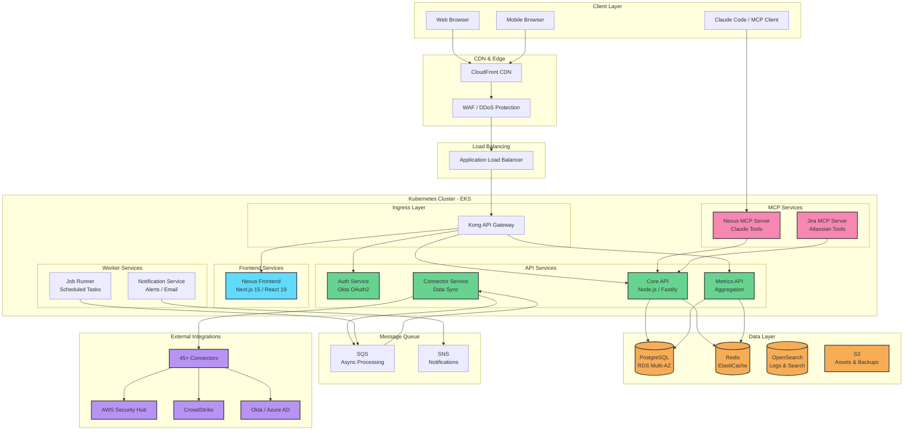

# System Architecture Diagram

## Full Platform Architecture

<!-- SVG: 01-system-architecture-1.svg -->

## Layer Descriptions

### Client Layer
- **Web Browser**: Primary access via desktop/laptop
- **Mobile Browser**: Responsive mobile experience
- **MCP Client**: Claude Code / AI assistant integration

### CDN & Edge
- **CloudFront**: Static asset caching, global distribution
- **WAF**: Web Application Firewall, rate limiting, DDoS protection

### Kubernetes Services
- **Frontend**: Next.js 15 with React 19, server-side rendering
- **API Services**: RESTful APIs with Fastify
- **Workers**: Background job processing
- **MCP**: Model Context Protocol servers for AI tooling

### Data Layer
- **PostgreSQL**: Primary transactional database (Multi-AZ)
- **Redis**: Session cache, query cache, rate limiting
- **OpenSearch**: Log aggregation and full-text search
- **S3**: Object storage for exports, backups

### External Integrations
- 45+ security tool connectors
- Cloud providers (AWS, Azure, GCP)
- Identity providers (Okta, Azure AD)
