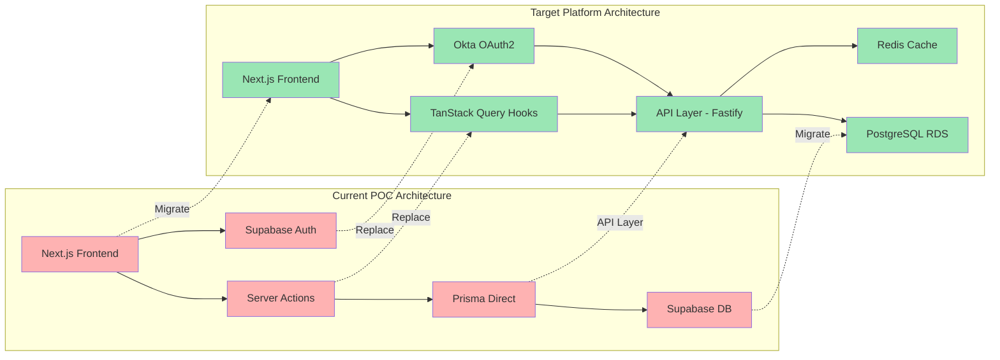
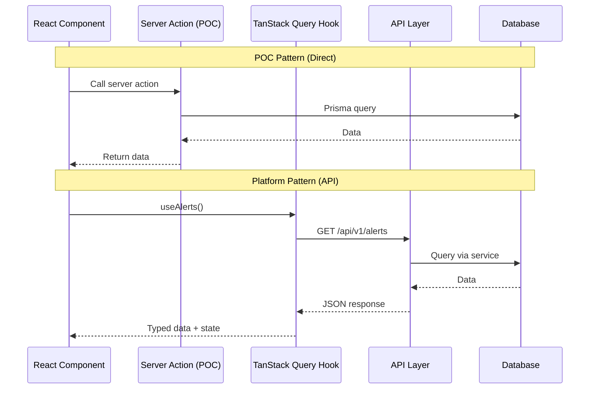
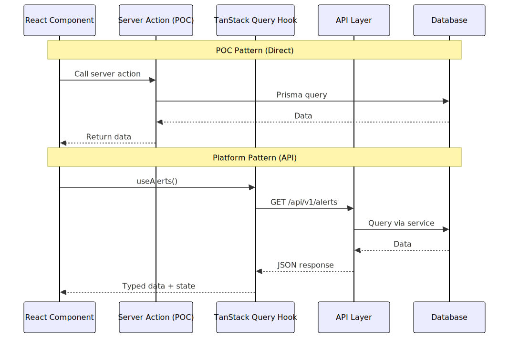
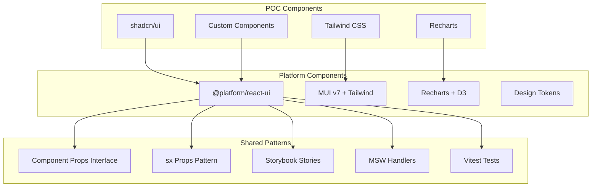

# Platform Alignment Diagram

## POC to Platform Migration

<!-- SVG: 02-platform-alignment-1.svg -->

## Data Fetching Migration

<!-- SVG: 02-platform-alignment-2.svg -->

## Component Library Alignment

<!-- SVG: 02-platform-alignment-3.svg -->

## Migration Checklist

| Layer | POC | Platform | Status |
|-------|-----|----------|--------|
| Auth | Supabase | Okta OAuth2 | Required |
| Database | Supabase DB | RDS PostgreSQL | Required |
| API | Server Actions | Fastify REST | Required |
| Data Fetching | Direct Prisma | TanStack Query | Required |
| State | Context/Local | TanStack Query | Required |
| Components | shadcn/ui | @platform/react-ui | Aligned |
| Styling | Tailwind | MUI + Tailwind | Aligned |
| Testing | Basic | Deep E2E | Required |
| MCP | None | Nexus + Jira | New |
