# MCP Integration Architecture

## Overview

This diagram shows the Model Context Protocol (MCP) integration architecture, enabling AI assistants like Claude to interact with the Armor platform suite.

## MCP Server Architecture

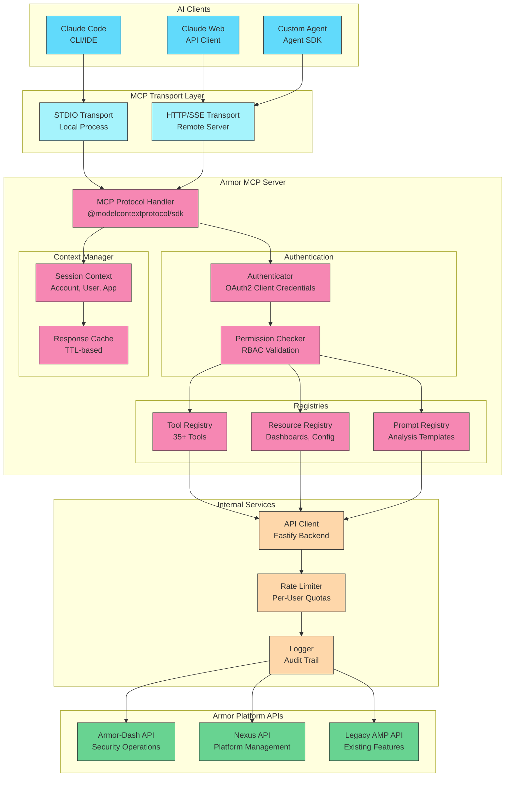

<!-- SVG: 03-mcp-integration-1.svg -->

## Tool Categories

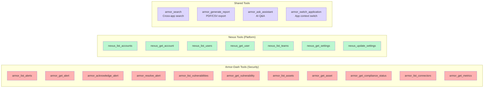

<!-- SVG: 03-mcp-integration-2.svg -->

## Authentication Flow

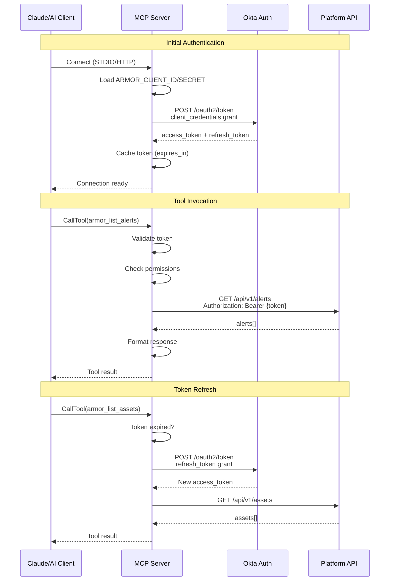

<!-- SVG: 03-mcp-integration-3.svg -->
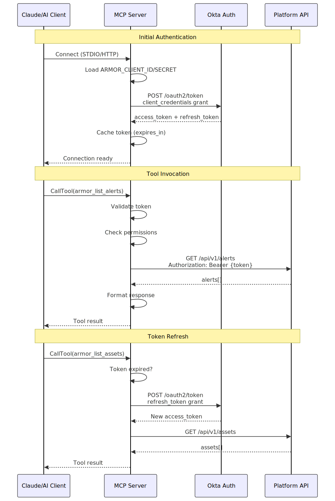

## Resource Types

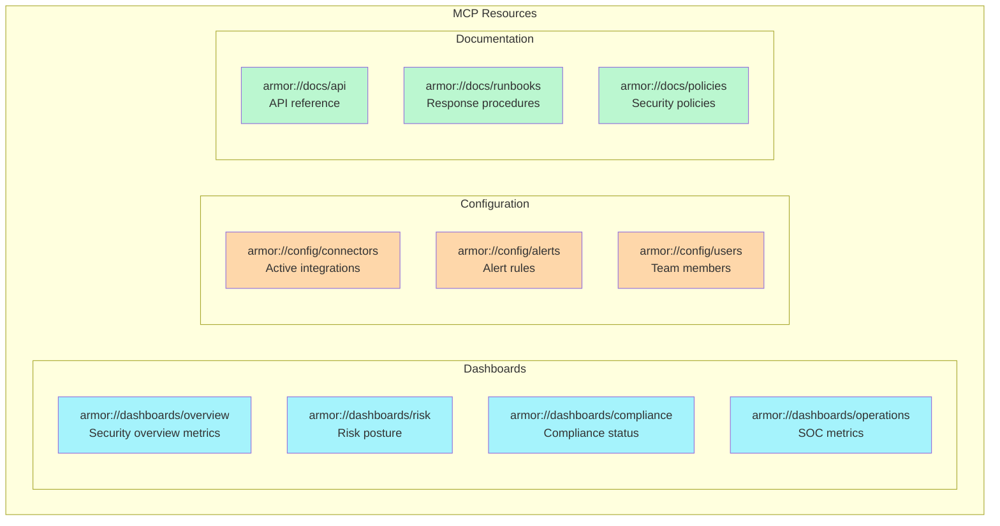

<!-- SVG: 03-mcp-integration-4.svg -->

## Prompt Templates

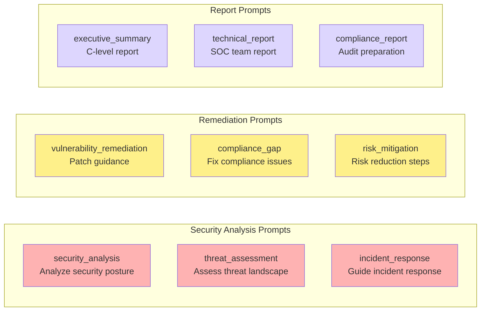

<!-- SVG: 03-mcp-integration-5.svg -->

## Multi-Application Context

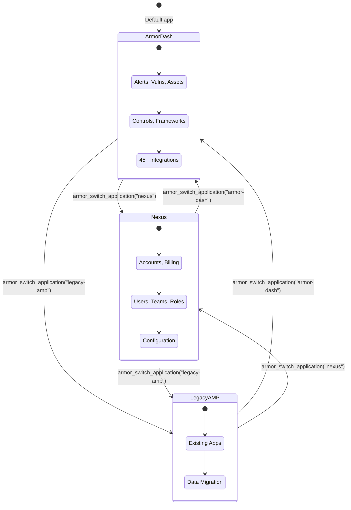

<!-- SVG: 03-mcp-integration-6.svg -->

## Deployment Architecture

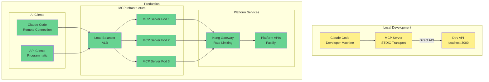

<!-- SVG: 03-mcp-integration-7.svg -->

## Error Handling

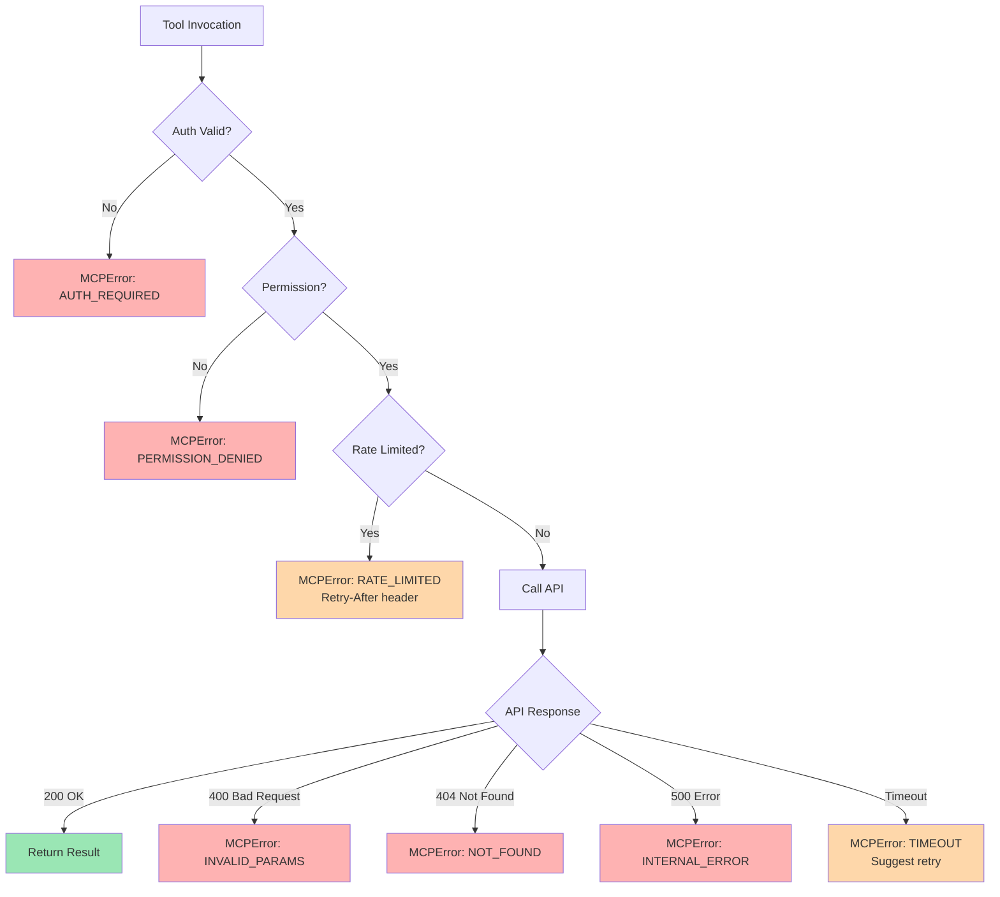

<!-- SVG: 03-mcp-integration-8.svg -->

## Key Specifications

### Performance Targets

| Metric | Target | Description |
|--------|--------|-------------|
| Tool Response Time | <2s (P95) | Most tool invocations |
| Auth Token Refresh | <500ms | Background refresh |
| Resource Read | <1s | Dashboard/config access |
| Concurrent Clients | 100+ | Per MCP server pod |

### Rate Limits

| Tier | Requests/min | Burst | Notes |
|------|--------------|-------|-------|
| Free | 60 | 10 | Per account |
| Pro | 300 | 50 | Per account |
| Enterprise | 1000 | 100 | Custom limits |

### Security Requirements

| Requirement | Implementation |
|-------------|----------------|
| Authentication | OAuth2 client credentials |
| Authorization | RBAC permission checks |
| Transport Security | TLS 1.3 (HTTP), Process isolation (STDIO) |
| Audit Logging | All tool invocations logged |
| Token Storage | Encrypted, never logged |
| Secrets | AWS Secrets Manager |

---

## Related Documentation

- [MCP Server Specification](../../planning-artifacts/20-mcp-server-specification.md) - Full tool specifications
- [System Architecture](./01-system-architecture.md) - Overall platform architecture
- [Authentication Flow](../security/01-auth-flow.md) - OAuth2/OIDC details
- [API Developer Experience](../../planning-artifacts/18-api-developer-experience.md) - API design

---

Last Updated: 2026-01-04
Maintained By: Platform Engineering Team
