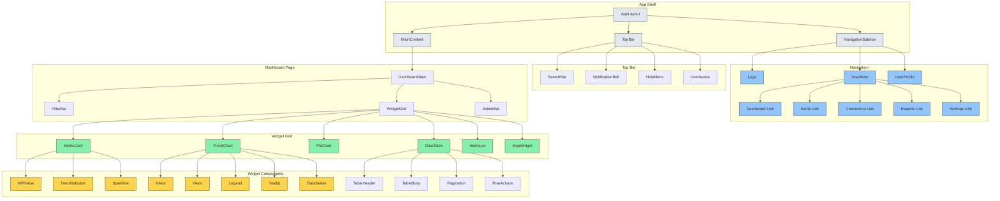
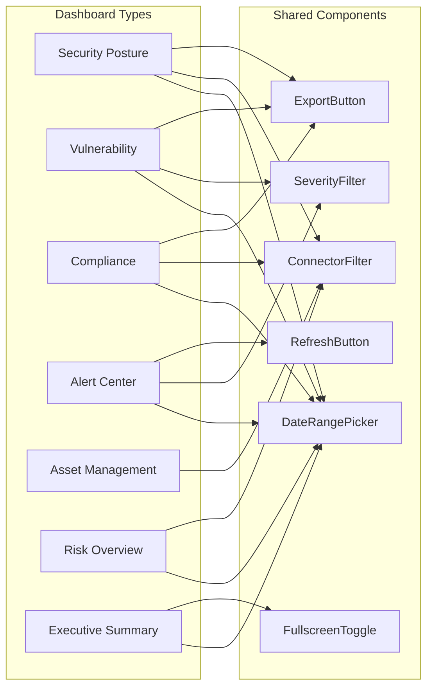
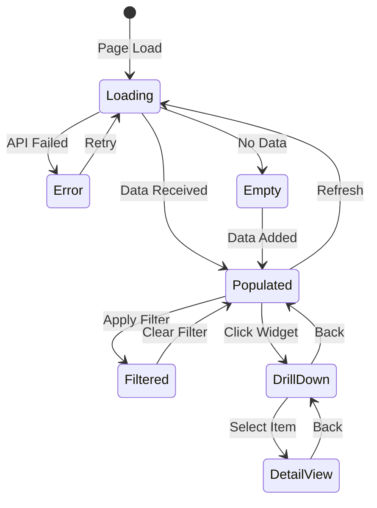

# Dashboard Component Hierarchy

## Component Tree Structure



<!-- SVG: 01-dashboard-hierarchy-1.svg -->



## Page Component Hierarchy



<!-- SVG: 01-dashboard-hierarchy-2.svg -->



## Component State Flow



<!-- SVG: 01-dashboard-hierarchy-3.svg -->



## Component Library Structure

| Category | Components | Platform Alignment |
|----------|------------|-------------------|
| Layout | AppShell, Sidebar, TopBar, Grid | MUI + Custom |
| Navigation | NavMenu, Breadcrumb, Tabs | MUI Tabs |
| Data Display | Card, Table, List, Badge | MUI + Custom |
| Charts | Line, Bar, Pie, Area, Scatter | Recharts |
| Forms | Input, Select, DatePicker, Checkbox | MUI Forms |
| Feedback | Alert, Toast, Modal, Drawer | MUI + Sonner |
| Actions | Button, IconButton, Menu, Tooltip | MUI Actions |

## Storybook Organization

```
stories/
├── layout/
│   ├── AppShell.stories.tsx
│   ├── Sidebar.stories.tsx
│   └── TopBar.stories.tsx
├── dashboards/
│   ├── SecurityPosture.stories.tsx
│   ├── Vulnerability.stories.tsx
│   └── Compliance.stories.tsx
├── widgets/
│   ├── MetricCard.stories.tsx
│   ├── TrendChart.stories.tsx
│   └── DataTable.stories.tsx
├── charts/
│   ├── LineChart.stories.tsx
│   ├── BarChart.stories.tsx
│   └── PieChart.stories.tsx
└── forms/
    ├── ConnectorForm.stories.tsx
    ├── FilterForm.stories.tsx
    └── SettingsForm.stories.tsx
```
