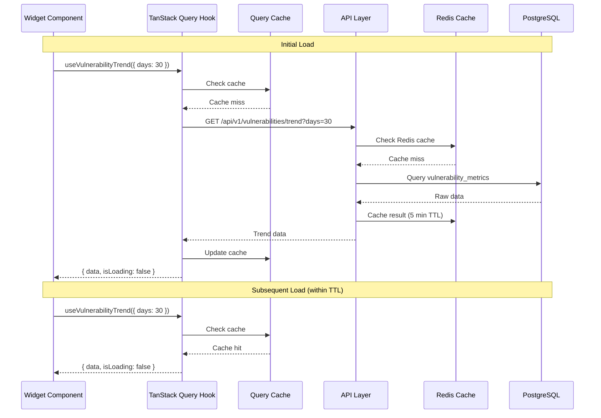
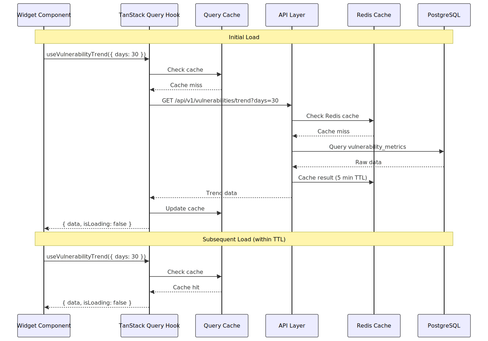
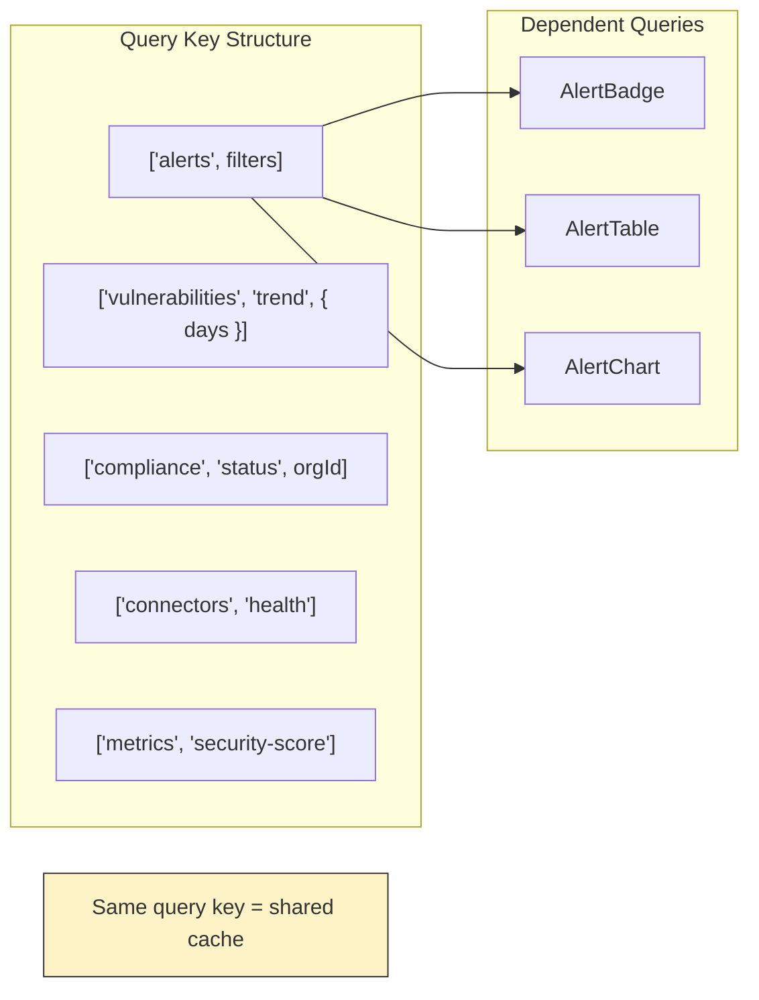
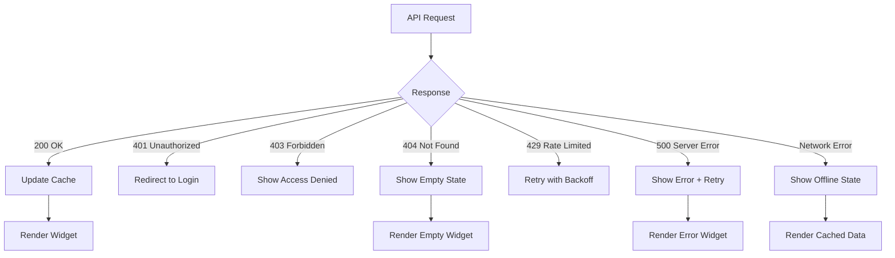

# Widget Data Dependencies

## Widget to API Mapping

```mermaid
graph TB
    subgraph "Dashboard Widgets"
        W1[Security Score Card]
        W2[Vulnerability Trend]
        W3[Compliance Status]
        W4[Active Alerts]
        W5[Asset Distribution]
        W6[Risk Heatmap]
        W7[Top Findings]
        W8[Connector Health]
    end

    subgraph "TanStack Query Hooks"
        H1[useSecurityScore]
        H2[useVulnerabilityTrend]
        H3[useComplianceStatus]
        H4[useAlerts]
        H5[useAssets]
        H6[useRiskMetrics]
        H7[useFindings]
        H8[useConnectorHealth]
    end

    subgraph "API Endpoints"
        A1[/api/v1/metrics/security-score]
        A2[/api/v1/vulnerabilities/trend]
        A3[/api/v1/compliance/status]
        A4[/api/v1/alerts]
        A5[/api/v1/assets]
        A6[/api/v1/risk/heatmap]
        A7[/api/v1/findings]
        A8[/api/v1/connectors/health]
    end

    subgraph "Data Sources"
        D1[(Metrics Aggregation)]
        D2[(Vulnerability DB)]
        D3[(Compliance Engine)]
        D4[(Alert Store)]
        D5[(Asset Inventory)]
        D6[(Risk Calculator)]
        D7[(Finding Store)]
        D8[(Connector Registry)]
    end

    W1 --> H1 --> A1 --> D1
    W2 --> H2 --> A2 --> D2
    W3 --> H3 --> A3 --> D3
    W4 --> H4 --> A4 --> D4
    W5 --> H5 --> A5 --> D5
    W6 --> H6 --> A6 --> D6
    W7 --> H7 --> A7 --> D7
    W8 --> H8 --> A8 --> D8

    classDef widget fill:#86EFAC,stroke:#333
    classDef hook fill:#93C5FD,stroke:#333
    classDef api fill:#FCD34D,stroke:#333
    classDef data fill:#F9A8D4,stroke:#333

    class W1,W2,W3,W4,W5,W6,W7,W8 widget
    class H1,H2,H3,H4,H5,H6,H7,H8 hook
    class A1,A2,A3,A4,A5,A6,A7,A8 api
    class D1,D2,D3,D4,D5,D6,D7,D8 data
```

## Data Flow Sequence



<!-- SVG: 02-widget-dependencies-2.svg -->



## Widget Refresh Strategy

| Widget | Stale Time | Refetch Interval | Refetch on Focus |
|--------|------------|------------------|------------------|
| Security Score | 5 min | 5 min | Yes |
| Alert Count | 30 sec | 30 sec | Yes |
| Vulnerability Trend | 10 min | 10 min | No |
| Compliance Status | 15 min | 15 min | No |
| Connector Health | 1 min | 1 min | Yes |
| Risk Heatmap | 30 min | 30 min | No |

## Shared Query Keys



<!-- SVG: 02-widget-dependencies-3.svg -->



## Error Handling



<!-- SVG: 02-widget-dependencies-4.svg -->



## Placeholder Data Pattern

```typescript
// REQUIRED: Always provide placeholderData for loading states
export function useSecurityScore() {
  return useQuery({
    queryKey: ['metrics', 'security-score'],
    queryFn: fetchSecurityScore,
    placeholderData: {
      score: 0,
      trend: 'neutral',
      breakdown: {
        vulnerabilities: 0,
        compliance: 0,
        alerts: 0
      }
    },
    staleTime: 5 * 60 * 1000, // 5 minutes
    refetchInterval: 5 * 60 * 1000
  });
}
```
