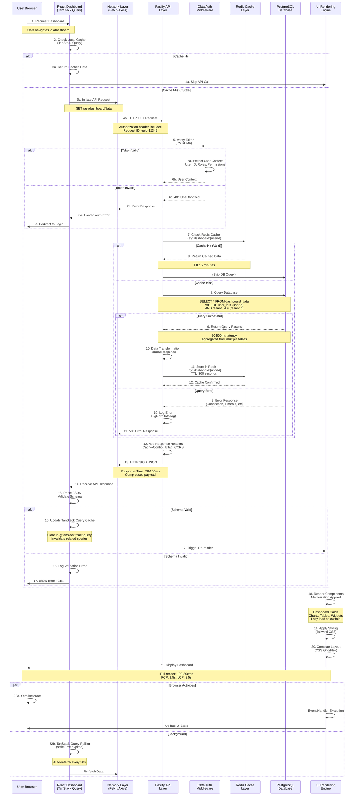
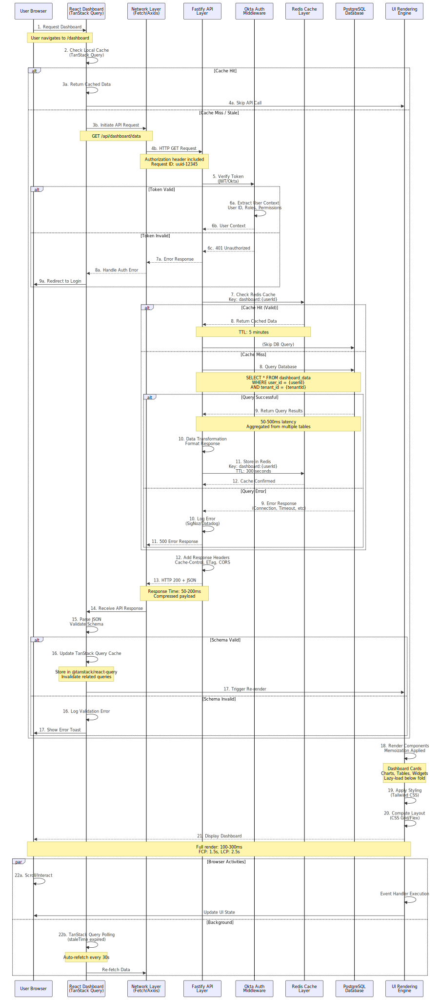

# Dashboard Data Request Cycle

## Overview

This diagram illustrates the complete data flow for dashboard requests in the Nexus UI platform, from initial user request through UI rendering. It demonstrates the interplay between TanStack Query, Fastify API layer, authentication, database, caching, and the frontend rendering pipeline.

## Sequence Diagram



<!-- SVG: 01-dashboard-request-1.svg -->



## Data Flow Layers

### Layer 1: Frontend (React/TanStack Query)
**Components:**
- React Dashboard Page Component
- TanStack Query (React Query) hooks
- Query client with cache management
- Stale-while-revalidate logic

**Key Features:**
- Automatic caching and synchronization
- Background refetching at configured intervals
- Request deduplication
- Optimistic updates support

**Performance Metrics:**
- Local cache hit: <5ms
- Query resolution: 50-200ms (API) or <5ms (cache)

### Layer 2: Network Transport Layer
**Components:**
- Fetch API or Axios HTTP client
- Request interceptors (auth token injection)
- Response interceptors (error handling)
- Network error handling and retries

**Headers Added:**
```
Authorization: Bearer {token}
X-Request-ID: {uuid}
X-API-Version: v1
Content-Type: application/json
Accept-Encoding: gzip, deflate
```

**Timeouts:**
- Connection: 10 seconds
- Request: 30 seconds
- Total: 60 seconds

### Layer 3: API Gateway (Fastify)
**Components:**
- HTTP routing and matching
- Middleware pipeline execution
- Request validation
- Response serialization

**Middleware Stack:**
1. Request logging (correlate with request ID)
2. Rate limiting check
3. CORS header injection
4. Auth middleware (Okta verification)
5. Request context setup
6. Response compression (gzip)
7. Error handling

**Processing Time:** 10-50ms (excluding downstream operations)

### Layer 4: Authentication (Okta)
**Components:**
- JWT token validation
- Token claims extraction
- Permission checking
- Tenant context establishment

**Token Lifecycle:**
```
Issued: JWT with 1-hour expiry
Refresh: Via refresh token rotation
Validation: RS256 signature verification
Claims: sub, email, tenant_id, roles
```

**Okta Integration:**
- Token endpoint: https://your-org.okta.com/oauth2/v1/token
- Introspect endpoint for validation
- Cache token validation result (TTL: 5 minutes)

### Layer 5: Cache Layer (Redis)
**Components:**
- Redis cluster for distributed caching
- Key: `dashboard:{userId}`
- Data structure: JSON serialized

**Cache Patterns:**
- **TTL Strategy:** 5 minutes for dashboard data
- **Invalidation:** On user action (create/update/delete)
- **Refresh:** Background job before expiry
- **Distributed:** Multi-region cache coherence via pub/sub

**Hit Rate Target:** 70-80%

**Cache Keys:**
```
dashboard:{userId}
dashboard:{userId}:summary
dashboard:{userId}:recent-alerts
dashboard:{userId}:metrics
```

### Layer 6: Database (PostgreSQL)
**Components:**
- Primary database replica for read queries
- Connection pooling (PgBouncer)
- Query optimization with indexes

**Queries Executed:**
```sql
-- Main dashboard data
SELECT * FROM dashboard_data
WHERE user_id = $1 AND tenant_id = $2

-- Recent alerts
SELECT * FROM alerts
WHERE tenant_id = $2 AND created_at > NOW() - INTERVAL '24 hours'
ORDER BY created_at DESC LIMIT 50

-- User preferences
SELECT * FROM user_preferences
WHERE user_id = $1
```

**Performance Characteristics:**
- Query execution: 20-100ms
- Network roundtrip: 5-20ms
- Connection acquisition: <5ms
- Total latency: 50-150ms

**Indexes:**
- `dashboard_data(user_id, tenant_id)` - BTREE
- `alerts(tenant_id, created_at)` - BTREE
- `user_preferences(user_id)` - BTREE

### Layer 7: UI Rendering
**Components:**
- Virtual DOM reconciliation
- Component memoization (@memo)
- Lazy loading of below-fold content
- CSS-in-JS styling (Tailwind)

**Render Performance:**
- Initial render: 100-300ms
- First Contentful Paint (FCP): 1.5 seconds
- Largest Contentful Paint (LCP): 2.5 seconds
- Cumulative Layout Shift (CLS): <0.1

**Optimization Techniques:**
- React.memo for child components
- useMemo for expensive calculations
- Code splitting with dynamic imports
- Image lazy loading with Intersection Observer

## Error Handling Flows

### Authentication Failures
```
1. Token validation fails at Okta middleware
2. API returns 401 Unauthorized
3. Frontend detects 401 response
4. Clear stored token from localStorage
5. Redirect user to /login
6. Show "Session expired" message
7. User re-authenticates
```

### Database Query Errors
```
1. PostgreSQL connection timeout
2. API catches error in try/catch
3. Log error with correlation ID to SigNoz
4. Check if partial data available from cache
5. Return 500 with error details
6. Frontend shows "Unable to load dashboard" toast
7. Provide "Retry" button for manual refetch
8. Auto-retry with exponential backoff after 5s
```

### API Response Validation Errors
```
1. Response schema validation fails
2. Frontend detects validation error
3. Log validation error with response payload
4. Show "Data format error" notification
5. Fall back to cached data if available
6. Trigger error boundary to prevent crash
```

### Network Connection Errors
```
1. Network request times out
2. Frontend detects timeout error
3. Show "Connection timeout" message
4. Queue request for retry
5. Auto-retry with exponential backoff (500ms → 2s → 8s)
6. Show offline indicator if persistent failure
7. Resume on connection restore
```

## Caching Strategy

### Cache Hierarchy
```
Level 1: Browser Cache
├─ TanStack Query in-memory cache
├─ staleTime: 5 minutes
└─ gcTime: 10 minutes (garbage collection)

Level 2: Redis Cache (Server-Side)
├─ Key: dashboard:{userId}
├─ TTL: 5 minutes
└─ Shared across all API replicas

Level 3: Database
├─ PostgreSQL with replication
├─ Read replicas for analytics
└─ Full historical data
```

### Cache Invalidation
**Automatic Invalidation Triggers:**
1. TTL expiry (5 minutes)
2. User updates dashboard settings
3. New alerts arrive (webhook trigger)
4. Manual refresh action
5. Background job every 30 minutes

**Invalidation Mechanism:**
```
1. Delete from Redis: dashboard:{userId}
2. Publish to Redis Pub/Sub: dashboard:invalidated:{userId}
3. TanStack Query refetch triggered
4. Fresh data fetched from database
```

## Monitoring and Observability

### Key Metrics
- **API Response Time:** Track p50, p95, p99
- **Cache Hit Rate:** Target 70-80%
- **Database Query Time:** Track slow queries (>100ms)
- **Error Rate:** Track 4xx and 5xx responses
- **User Engagement:** FCP, LCP, CLS measurements

### Tracing
- **Request ID:** Injected in all requests
- **Trace ID:** Follows request through entire stack
- **Span Details:** Auth time, cache check time, DB query time
- **Error Context:** Full stack trace with line numbers

### Logging
- **SigNoz Integration:** Structured JSON logging
- **Log Levels:** DEBUG (local), INFO (production)
- **Sensitive Data:** Token and user ID redacted from logs
- **Audit Trail:** User actions logged with timestamps

## Performance Targets

| Metric | Target | Notes |
|--------|--------|-------|
| API Response Time (p95) | <200ms | Cache hit |
| API Response Time (p95) | <500ms | Cache miss |
| First Contentful Paint | <1.5s | Full page load |
| Largest Contentful Paint | <2.5s | Dashboard fully visible |
| Cache Hit Rate | >70% | Reduces backend load |
| Database Query Time (p95) | <100ms | With proper indexes |
| Network Latency | <50ms | Depends on geography |

## Related Diagrams

- [System Architecture](../architecture/01-system-architecture.md) - Overall system design
- [02-Connector Sync Flow](./02-connector-sync.md) - Data ingestion pipeline
- [Real-Time Updates Flow](./05-real-time-updates.md) - WebSocket/SSE updates

## Additional Resources

- [TanStack Query Documentation](https://tanstack.com/query/latest)
- [Fastify API Guide](https://www.fastify.io/)
- [Okta Authentication](https://developer.okta.com/)
- [Redis Caching Strategies](https://redis.io/topics/client-side-caching)
- [PostgreSQL Performance Tuning](https://www.postgresql.org/docs/current/performance.html)
