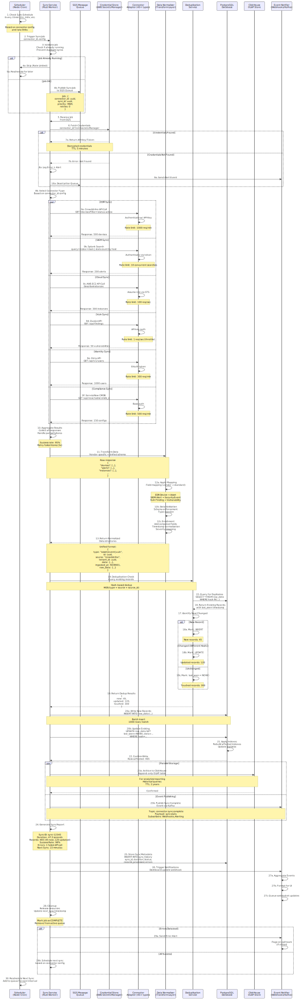

# Connector Sync Flow

## Overview

This diagram illustrates the complete data synchronization pipeline for the 45+ connector types in Nexus UI. It shows how scheduled sync jobs orchestrate data collection across diverse security tools (EDR, SIEM, Cloud, Vulnerability, Identity, Compliance), normalize disparate formats, and persist unified data in the platform database.

## Sequence Diagram

```mermaid
sequenceDiagram
    participant Scheduler as Scheduler<br/>(Node-Cron)
    participant SyncSvc as Sync Service<br/>(Rust Worker)
    participant Queue as SQS Message<br/>Queue
    participant Auth as Credential Store<br/>(AWS Secrets Manager)
    participant Connector as Connector<br/>Adapter (45+ types)
    participant Normalizer as Data Normalizer<br/>(Transform Layer)
    participant Dedup as Deduplication<br/>Service
    participant DB as PostgreSQL<br/>Database
    participant Storage as ClickHouse<br/>OLAP Store
    participant Notify as Event Notifier<br/>(Webhooks/Kafka)

    Scheduler->>Scheduler: 1. Check Sync Schedule<br/>Every 15min, 1hr, 24hr, etc.
    Note over Scheduler: Based on connector config<br/>and rate limits

    Scheduler->>SyncSvc: 2. Trigger Sync Job<br/>connector_id, config

    SyncSvc->>SyncSvc: 3. Validate Job<br/>Check if already running<br/>Prevent duplicate syncs
    alt Job Already Running
        SyncSvc->>Scheduler: 4a. Skip (Rate Limited)
        Scheduler->>Scheduler: 5a. Reschedule for later
    else Job OK
        SyncSvc->>Queue: 4b. Publish Sync Job<br/>to SQS Queue
        Note over SyncSvc,Queue: Job: {<br/>  connector_id: uuid,<br/>  sync_id: uuid,<br/>  priority: HIGH,<br/>  retries: 0<br/>}
    end

    Queue->>SyncSvc: 5. Receive Job<br/>from SQS
    SyncSvc->>Auth: 6. Fetch Credentials<br/>connector_id from Secrets Manager
    alt Credentials Found
        Auth-->>SyncSvc: 7a. Return API Key/Token
        Note over Auth,SyncSvc: Decrypted credentials<br/>TTL: 5 minutes
    else Credentials Not Found
        Auth-->>SyncSvc: 7b. Error: Not Found
        SyncSvc->>SyncSvc: 8a. Log Error + Alert
        SyncSvc->>Notify: 9a. Send Alert Event
        SyncSvc->>Queue: 10a. Dead Letter Queue
    end

    SyncSvc->>SyncSvc: 8b. Select Connector Type<br/>Based on connector_id config

    par EDR Sync
        SyncSvc->>Connector: 9a. Crowdstrike API Call<br/>GET /devices?filter=status:active
        Connector->>Connector: Authenticate w/ API Key
        Note over Connector: Rate limit: 1000 req/min
        Connector-->>SyncSvc: Response: 500 devices
    and SIEM Sync
        SyncSvc->>Connector: 9b. Splunk Search<br/>query=index=main | stats count by host
        Connector->>Connector: Authenticate via token
        Note over Connector: Rate limit: 10 concurrent searches
        Connector-->>SyncSvc: Response: 200 alerts
    and Cloud Sync
        SyncSvc->>Connector: 9c. AWS EC2 API Call<br/>DescribeInstances
        Connector->>Connector: Assume role via STS
        Note over Connector: Rate limit: 100 req/sec
        Connector-->>SyncSvc: Response: 300 instances
    and Vuln Sync
        SyncSvc->>Connector: 9d. Qualys API<br/>GET /api/findings
        Connector->>Connector: API key auth
        Note over Connector: Rate limit: 1 req/sec (throttle)
        Connector-->>SyncSvc: Response: 50 vulnerabilities
    and Identity Sync
        SyncSvc->>Connector: 9e. Okta API<br/>GET /api/v1/users
        Connector->>Connector: OAuth token
        Note over Connector: Rate limit: 300 req/min
        Connector-->>SyncSvc: Response: 1000 users
    and Compliance Sync
        SyncSvc->>Connector: 9f. ServiceNow CMDB<br/>GET /api/now/table/cmdb_ci
        Connector->>Connector: Basic auth
        Note over Connector: Rate limit: 500 req/min
        Connector-->>SyncSvc: Response: 150 configs
    end

    SyncSvc->>SyncSvc: 10. Aggregate Results<br/>Collect all responses<br/>Handle partial failures
    Note over SyncSvc: Success rate: 95%<br/>Retry failed items (3x)

    SyncSvc->>Normalizer: 11. Transform Data<br/>Vendor-specific → Unified schema
    Note over SyncSvc,Normalizer: Raw response<br/>{<br/>  "devices": [...],<br/>  "alerts": [...],<br/>  "instances": [...],<br/>  ...<br/>}

    Normalizer->>Normalizer: 12a. Apply Mapping<br/>Field mapping (vendor → standard)
    Note over Normalizer: EDR Device → Asset<br/>SIEM Alert → SecurityEvent<br/>Vuln Finding → Vulnerability

    Normalizer->>Normalizer: 12b. Data Validation<br/>Schema enforcement<br/>Type coercion

    Normalizer->>Normalizer: 12c. Enrichment<br/>Add computed fields<br/>Timestamp normalization<br/>Severity mapping

    Normalizer-->>SyncSvc: 13. Return Normalized<br/>Data structures
    Note over Normalizer,SyncSvc: Unified format:<br/>{<br/>  type: "asset|event|vuln",<br/>  id: uuid,<br/>  source: "crowdstrike",<br/>  tenant_id: uuid,<br/>  data: {...},<br/>  ingested_at: ISO8601,<br/>  raw_data: {...}<br/>}

    SyncSvc->>Dedup: 14. Deduplication Check<br/>Query existing records
    Note over SyncSvc,Dedup: Hash-based dedup<br/>MD5(type + source + source_id)

    Dedup->>DB: 15. Query for Duplicates<br/>SELECT * FROM raw_data<br/>WHERE hash IN (...)

    DB-->>Dedup: 16. Return Existing Records<br/>with last_seen timestamp

    Dedup->>Dedup: 17. Identify New/Changed
    alt New Record
        Dedup->>Dedup: 18a. Mark: INSERT
        Note over Dedup: New records: 45
    else Changed (Different Hash)
        Dedup->>Dedup: 18b. Mark: UPDATE
        Note over Dedup: Updated records: 120
    else Unchanged
        Dedup->>Dedup: 18c. Mark: last_seen = NOW()
        Note over Dedup: Touched records: 300
    end

    Dedup-->>SyncSvc: 19. Return Dedup Results<br/>{<br/>  new: 45,<br/>  updated: 120,<br/>  touched: 300<br/>}

    SyncSvc->>DB: 20a. Write New Records<br/>INSERT INTO raw_data (...)
    Note over SyncSvc,DB: Batch insert<br/>1000 rows / batch

    SyncSvc->>DB: 20b. Update Existing<br/>UPDATE raw_data SET<br/>last_seen=NOW(), data=...<br/>WHERE hash=...

    DB->>DB: 21. Apply Indexes<br/>Rebuild affected indexes<br/>Update statistics

    DB-->>SyncSvc: 22. Confirm Write<br/>Rows affected: 465

    par Parallel Storage
        SyncSvc->>Storage: 23a. Archive to ClickHouse<br/>Append-only OLAP table
        Note over SyncSvc,Storage: For analytics/reporting<br/>Historical queries<br/>TTL: 2 years
        Storage-->>SyncSvc: Confirmed
    and Event Publishing
        SyncSvc->>Notify: 23b. Publish Sync Complete<br/>Event via Kafka
        Note over SyncSvc,Notify: Topic: connector.sync.complete<br/>Payload: sync stats<br/>Subscribers: Webhooks, Alerting
    end

    SyncSvc->>SyncSvc: 24. Generate Sync Report
    Note over SyncSvc: Sync ID: sync-12345<br/>Duration: 47.3 seconds<br/>Records: 465 (45 new, 120 updated)<br/>Success Rate: 98%<br/>Errors: 1 failed API call<br/>Next Sync: 15 minutes

    SyncSvc->>DB: 25. Store Sync Metadata<br/>INSERT INTO sync_history<br/>sync_id, duration, status,<br/>records_processed, errors

    SyncSvc->>Notify: 26. Trigger Notifications<br/>Dashboard update webhook

    Notify->>Notify: 27a. Aggregate Events
    Notify->>Notify: 27b. Format for UI
    Notify->>Notify: 27c. Queue websocket updates

    SyncSvc->>SyncSvc: 28. Cleanup<br/>Release resources<br/>Update next_sync timestamp
    Note over SyncSvc: Mark job as COMPLETE<br/>Remove from active queue

    alt Errors Detected
        SyncSvc->>Notify: 29a. Send Error Alert
        Notify->>Notify: Page on-call team<br/>(if critical)
    else All Success
        SyncSvc->>SyncSvc: 29b. Schedule next sync<br/>based on connector config
    end

    Scheduler->>Scheduler: 30. Reschedule Next Sync<br/>Add to queue for next interval
```



<!-- SVG: 02-connector-sync-1.svg -->



## Connector Types (45+)

### EDR (Endpoint Detection & Response) - 6 types
```
1. CrowdStrike Falcon
2. Microsoft Defender for Endpoint
3. Cybereason
4. Carbon Black
5. Palo Alto Cortex XDR
6. SentinelOne
```

### SIEM (Security Information & Event Management) - 5 types
```
1. Splunk Enterprise
2. IBM QRadar
3. ArcSight
4. Elastic Security
5. Exabeam
```

### Cloud Security - 8 types
```
1. AWS Security Hub
2. Azure Defender
3. Google Cloud Security Command Center
4. Wiz
5. Lacework
6. CloudTrail (AWS)
7. Azure Activity Log
8. GCP Audit Logs
```

### Vulnerability Management - 5 types
```
1. Qualys VMDR
2. Tenable Nessus/Nessus Cloud
3. Rapid7 InsightVM
4. Acunetix
5. OpenVAS
```

### Identity & Access Management - 6 types
```
1. Okta
2. Azure Active Directory
3. Ping Identity
4. Salesforce Identity
5. AWS IAM
6. OneLogin
```

### Compliance & Risk - 8 types
```
1. ServiceNow CMDB
2. Jira for issue tracking
3. Atlassian StatusPage
4. HashiCorp Vault
5. CyberArk PAM
6. Delinea Secret Server
7. Compliance as Code platforms
8. Custom webhooks
```

### Additional Tools - 7 types
```
1. Network monitoring (Cisco, Fortinet)
2. Threat Intelligence (CrowdStrike Intelligence, MISP)
3. Ticketing (ServiceNow, Jira Service Management)
4. Communication (Slack, Teams, email)
5. Analytics (Datadog, New Relic)
6. Firewall logs (Palo Alto, Fortinet, Checkpoint)
7. Other enterprise platforms
```

## Data Flow Layers

### Layer 1: Scheduling Engine
**Components:**
- Node-Cron scheduler (time-based)
- Queue-based job distribution
- Rate limiting per connector

**Configuration:**
```json
{
  "connector_id": "crowdstrike-prod",
  "sync_interval": "15 minutes",
  "priority": "HIGH",
  "timeout": 300,
  "retry_policy": {
    "max_retries": 3,
    "backoff_multiplier": 2.0,
    "initial_delay": 1000
  }
}
```

**Scheduling Strategy:**
- Stagger connectors to avoid thundering herd
- Respect vendor rate limits
- Adjust frequency based on data volatility
- Manual trigger support for on-demand sync

### Layer 2: Sync Service (Rust Worker)
**Components:**
- Async Rust runtime (Tokio)
- Job processor
- Connector orchestration
- Error handling and retry logic

**Responsibilities:**
1. Fetch and validate credentials
2. Load connector adapter
3. Execute API calls in parallel
4. Handle rate limits and backoff
5. Aggregate results
6. Error tracking and alerts

**Performance:**
- Process up to 6 connectors in parallel
- Handle 1000+ concurrent requests
- Throughput: 10,000 records/second

### Layer 3: Connector Adapters
**Architecture:**
```
Base Connector Interface
├── AuthenticationHandler
│   ├── APIKeyAuth
│   ├── OAuthHandler
│   ├── BasicAuth
│   └── CustomAuth
├── APICaller
│   ├── REST endpoints
│   ├── GraphQL queries
│   ├── Custom protocols
│   └── Rate limiting
├── ErrorHandler
│   ├── Retry logic
│   ├── Circuit breaker
│   └── Fallback strategy
└── ResponseParser
    ├── JSON/XML parsing
    ├── Pagination handling
    └── Error detection
```

**Connector Template:**
```rust
pub trait Connector {
    async fn authenticate(&self, creds: &Credentials) -> Result<()>;
    async fn fetch(&self, query: &Query) -> Result<Vec<Record>>;
    async fn validate_response(&self, resp: &Response) -> Result<()>;
}
```

### Layer 4: Data Normalization
**Transformation Pipeline:**

```
Raw API Response
    ↓
Field Mapping (Vendor → Standard)
    ├── edgecase.device_name → asset.name
    ├── edgecase.os_version → asset.os
    └── edgecase.status → asset.state
    ↓
Type Coercion
    ├── Strings to enums
    ├── Timestamps to ISO8601
    └── Numbers to proper types
    ↓
Data Enrichment
    ├── Add source attribution
    ├── Compute severity scores
    ├── Add geolocation data
    └── Normalize time zones
    ↓
Unified Schema Validation
    └── Ensure all required fields
    └── Check value constraints
    └── Validate relationships
```

**Unified Data Model:**
```typescript
interface NormalizedRecord {
  id: string;                    // UUID
  type: "asset" | "event" | "vulnerability" | "user";
  source: string;                // Connector name
  source_id: string;             // Vendor's unique ID
  tenant_id: string;             // Multi-tenancy
  data: Record<string, unknown>; // Vendor-specific data
  hash: string;                  // MD5 for dedup
  ingested_at: ISO8601DateTime;
  last_seen: ISO8601DateTime;
  raw_data: Record<string, unknown>; // Original response
  metadata: {
    sync_id: string;
    sync_run: number;
    confidence: number;
    is_partial: boolean;
  };
}
```

### Layer 5: Deduplication Service
**Algorithm:**

```
1. Compute hash = MD5(type + source + source_id)
2. Look up existing record by hash
3. Compare with last known state
4. Classify as: NEW | UPDATED | UNCHANGED
5. Update last_seen timestamp
6. Merge with existing metadata
```

**Dedup Strategies by Type:**
```
Assets:
  hash = MD5(type + source + vendor_device_id)

Events:
  hash = MD5(type + source + event_id + timestamp)
  Time window: Same event within 5 minutes = duplicate

Vulnerabilities:
  hash = MD5(type + source + cve_id + asset_id)
  Matches across multiple sources

Users:
  hash = MD5(type + source + email)
  Single canonical record per user
```

### Layer 6: Database Layer (PostgreSQL)
**Schema:**
```sql
CREATE TABLE raw_data (
  id UUID PRIMARY KEY,
  tenant_id UUID NOT NULL,
  source VARCHAR(255) NOT NULL,
  type VARCHAR(50) NOT NULL, -- asset, event, vuln, user
  source_id VARCHAR(500) NOT NULL,
  hash VARCHAR(32) NOT NULL,
  data JSONB NOT NULL,
  raw_data JSONB NOT NULL,
  ingested_at TIMESTAMP NOT NULL,
  last_seen TIMESTAMP NOT NULL,
  created_at TIMESTAMP DEFAULT NOW(),
  updated_at TIMESTAMP DEFAULT NOW(),
  UNIQUE(tenant_id, source, source_id, type),
  INDEX(tenant_id, type, last_seen),
  INDEX(hash),
  INDEX(ingested_at)
);

CREATE TABLE sync_history (
  id UUID PRIMARY KEY,
  tenant_id UUID NOT NULL,
  connector_id UUID NOT NULL,
  sync_id VARCHAR(100) NOT NULL,
  status VARCHAR(20) NOT NULL, -- RUNNING, SUCCESS, FAILED, PARTIAL
  records_processed INT NOT NULL,
  records_new INT NOT NULL,
  records_updated INT NOT NULL,
  errors_count INT NOT NULL,
  duration_ms INT NOT NULL,
  error_details JSONB,
  started_at TIMESTAMP NOT NULL,
  completed_at TIMESTAMP,
  next_sync_at TIMESTAMP,
  created_at TIMESTAMP DEFAULT NOW(),
  INDEX(tenant_id, connector_id, started_at)
);
```

**Write Patterns:**
- Batch inserts: 1000 rows/batch
- Upsert for updates: ON CONFLICT update
- Deferred constraint checking
- Parallel commits for multi-connector syncs

**Query Patterns:**
- Get latest records: ORDER BY ingested_at DESC LIMIT
- Dedup lookup: WHERE hash = $1
- Sync history: WHERE connector_id = $1 ORDER BY started_at

### Layer 7: ClickHouse Analytics Store
**Purpose:**
- Time-series analytics
- Historical data archive
- Fast aggregation queries

**Table Schema:**
```
CREATE TABLE raw_data_archive (
  id UUID,
  tenant_id UUID,
  source String,
  type String,
  data String, -- JSON
  ingested_at DateTime,
  ingestion_year Int32,
  ingestion_month Int32
) ENGINE = MergeTree()
ORDER BY (tenant_id, source, ingested_at)
PARTITION BY toYYYYMM(ingested_at)
TTL ingested_at + INTERVAL 2 YEAR DELETE
```

**Benefits:**
- Compressed storage (10:1 ratio)
- Fast analytical queries
- Time-series functions
- Retention policies

### Layer 8: Event Notification
**Message Format:**
```json
{
  "event_type": "connector.sync.complete",
  "sync_id": "sync-12345",
  "connector_id": "crowdstrike-prod",
  "tenant_id": "tenant-abc",
  "status": "SUCCESS",
  "records": {
    "new": 45,
    "updated": 120,
    "touched": 300
  },
  "duration_ms": 47300,
  "errors": [],
  "timestamp": "2024-01-15T14:23:45Z"
}
```

**Subscribers:**
- Dashboard webhooks (real-time updates)
- Kafka topics (processing pipelines)
- Email/Slack alerts (team notifications)
- Monitoring systems (SigNoz/Datadog)

## Error Handling Strategy

### Connector-Level Errors
```
1. Connection Timeout (5-second retry)
   → Skip connector, continue others
   → Mark as PARTIAL failure

2. Authentication Failed
   → Rotate credentials from Secrets Manager
   → Retry once with new creds
   → Alert on-call if still fails

3. Rate Limit Hit
   → Back off exponentially
   → Retry in next scheduled window
   → Never skip record on rate limit

4. API Returns 5xx
   → Exponential backoff: 1s, 2s, 4s, 8s
   → Max 3 retries per API call
   → Partial data acceptable
```

### Aggregation-Level Errors
```
1. Partial Failure (Some connectors fail)
   → Continue with successful ones
   → Mark sync as PARTIAL_SUCCESS
   → Notify which connectors failed

2. All Connectors Failed
   → Mark sync as FAILED
   → Alert on-call immediately
   → Preserve previous sync data
   → Do NOT roll back successful writes

3. Normalization Error
   → Skip record, log with details
   → Continue processing other records
   → Report error in sync summary
```

### Recovery Strategies
```
Failed Sync Recovery:
1. Auto-retry after 5 minutes
2. If still fails, retry after 1 hour
3. If still fails, alert for manual intervention
4. Preserve all partial data for analysis

Dead Letter Queue:
1. Jobs that fail 3+ times → DLQ
2. Retain for manual reprocessing
3. Alert team for investigation
```

## Monitoring and Observability

### Key Metrics
```
Per-Connector Metrics:
- Sync duration (p50, p95, p99)
- Record throughput (records/sec)
- Error rate (% failed syncs)
- API rate limit hit rate
- Credential refresh frequency

Aggregate Metrics:
- Total records ingested per hour
- New vs. updated vs. unchanged
- Dedup hit rate
- Database write latency
- ClickHouse archival lag
```

### Alerting Rules
```
1. Sync Duration > 5 minutes (timeout warning)
2. Error Rate > 10% (degradation)
3. All Connectors Failed (P1 page)
4. Authentication failures (check credentials)
5. Dedup latency > 1s (performance)
6. Database write latency > 100ms (bottleneck)
```

### Tracing
```
Each sync gets:
- Unique sync_id (UUID)
- Trace spans for each connector
- Detailed timing breakdowns:
  - Auth time
  - API call time
  - Normalization time
  - Dedup check time
  - Database write time
  - Event publishing time
```

## Performance Targets

| Component | Target | Notes |
|-----------|--------|-------|
| Connector Sync Time | <1 minute | Per connector |
| Total Sync Cycle | <5 minutes | All 45+ connectors |
| Normalization Time | <10ms | Per record |
| Dedup Lookup | <1ms | Redis-backed |
| Database Write | <100ms | 1000 row batch |
| Event Publishing | <500ms | All subscribers |
| Error Recovery | <5 minutes | Auto-retry |
| Success Rate | >95% | Across all connectors |

## Related Diagrams

- [Dashboard Request Flow](./01-dashboard-request.md) - Querying synced data
- [Multi-Connector Aggregation](./03-multi-connector.md) - Cross-source queries
- [System Architecture](../architecture/01-system-architecture.md) - Overall system

## Additional Resources

- [Connector Implementation Guide](../../patterns/connector-adapter-pattern.md)
- [Data Normalization Rules](../../patterns/data-normalization.md)
- [Rate Limiting Best Practices](https://cloud.google.com/architecture/rate-limiting-strategies-techniques)
- [Deduplication Algorithms](https://en.wikipedia.org/wiki/Record_linkage)
- [ClickHouse Documentation](https://clickhouse.com/docs/en/intro)
