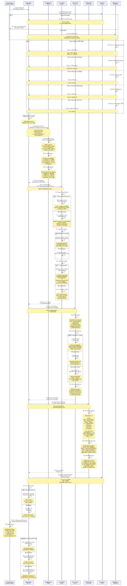

# Multi-Connector Data Aggregation Flow

## Overview

This diagram illustrates how Nexus UI aggregates and correlates data from multiple disparate security and IT sources into a unified view. It demonstrates deduplication, correlation, enrichment, and the generation of actionable insights across the entire security ecosystem.

## Sequence Diagram

```mermaid
sequenceDiagram
    participant User as User Query<br/>(Dashboard/API)
    participant API as Aggregation<br/>Service
    participant Dedup as Deduplication<br/>Engine
    participant Corr as Correlation<br/>Engine
    participant Enrich as Enrichment<br/>Service
    participant Unify as Unified View<br/>Generator
    participant Cache as Response<br/>Cache
    participant DB as Multi-Source<br/>Database

    User->>API: 1. Query for Assets<br/>GET /api/assets?filter=...

    API->>Cache: 2. Check Response Cache<br/>Key: assets:query:hash
    alt Cache Hit (Valid)
        Cache-->>API: 3a. Return Cached Results
        Note over Cache,API: TTL: 5 minutes<br/>Computed aggregation
        API-->>User: 4a. Return Cached Response<br/>(Fast path: <50ms)
    else Cache Miss
        API->>DB: 3b. Query All Sources
        Note over API,DB: In parallel: Crowdstrike,<br/>AWS, Azure, Okta, ServiceNow
    end

    par Source Query 1: EDR Data
        DB->>DB: 4.1a Query: Crowdstrike Devices
        DB-->>API: Returns: 500 devices
        Note over DB,API: Source ID mapping<br/>device_id → asset.id
    and Source Query 2: Cloud Data
        DB->>DB: 4.1b Query: AWS EC2 Instances
        DB-->>API: Returns: 300 instances
        Note over DB,API: instance-id → asset.id
    and Source Query 3: Cloud Data
        DB->>DB: 4.1c Query: Azure VMs
        DB-->>API: Returns: 200 vms
        Note over DB,API: vm-id → asset.id
    and Source Query 4: Identity Data
        DB->>DB: 4.1d Query: Okta Users
        DB-->>API: Returns: 1000 users
        Note over DB,API: user-id → identity.id
    and Source Query 5: IT Service
        DB->>DB: 4.1e Query: ServiceNow CMDB
        DB-->>API: Returns: 800 config items
        Note over DB,API: ci-id → asset.id
    end

    API->>API: 5. Aggregate Raw Results<br/>Merge all source data
    Note over API: Total: 2800 records<br/>Multiple sources per entity

    API->>Dedup: 6. Deduplication Phase<br/>Identify same entity across sources
    Note over API,Dedup: Find relationships:<br/>1 physical server = <br/>  1 EC2 instance +<br/>  1 Crowdstrike device +<br/>  1 ServiceNow CI

    Dedup->>Dedup: 7. Build Dedup Graph<br/>Entity matching algorithm
    Note over Dedup: Matching Rules:<br/>├─ Exact: hostname match<br/>├─ Fuzzy: IP address<br/>└─ Heuristic: MAC address<br/>   + OS version match

    Dedup->>Dedup: 8a. Group by Device
    Note over Dedup: Group 1: prod-web-01<br/>├─ CS Device: cs-12345<br/>├─ EC2 Instance: i-abc123<br/>├─ ServiceNow CI: srv_xyz<br/>└─ Okta Apps: 3

    Dedup->>Dedup: 8b. Group by Identity
    Note over Dedup: Group 2: john.doe@company<br/>├─ Okta User: okta-456<br/>├─ LDAP User: ldap-789<br/>├─ GitHub User: jdoe-gh<br/>└─ Last login: 2 hours ago

    Dedup-->>API: 9. Return Dedup Map<br/>Entity groups: 1500 unique

    API->>Corr: 10. Correlation Phase<br/>Find relationships between entities
    Note over API,Corr: Inputs: Deduplicated groups

    Corr->>Corr: 11. Temporal Correlation
    alt Device Online Timeline
        Corr->>Corr: Match login events to<br/>device online status
        Note over Corr: User X logged in at 14:00<br/>Device was online from 13:30<br/>Confidence: HIGH
    else Threat Timeline
        Corr->>Corr: Correlate EDR alerts<br/>with firewall logs
        Note over Corr: Suspicious process on prod-web-01<br/>at 14:05 matches<br/>Outbound connection to<br/>malware C2 at 14:06
    end

    Corr->>Corr: 12. Spatial Correlation
    alt Network Proximity
        Corr->>Corr: Devices on same subnet<br/>Potential lateral movement
        Note over Corr: prod-web-01 (10.0.1.5)<br/>prod-api-01 (10.0.1.6)<br/>Risk: HIGH risk contact
    else Cloud Region
        Corr->>Corr: Instances in same<br/>AWS region/availability zone
    end

    Corr->>Corr: 13. Causal Correlation
    alt Threat Chain
        Corr->>Corr: EDR Alert → Vuln Match<br/> → Affected Asset
        Note over Corr: Crowdstrike detected<br/>exploitation attempt for<br/>CVE-2024-1234<br/>↓<br/>Qualys found same CVE<br/>on prod-web-01<br/>Risk Score: CRITICAL
    else Access Chain
        Corr->>Corr: User → Endpoint → Data
        Note over Corr: User with excessive<br/>permissions accessed<br/>sensitive data via<br/>unmonitored device
    end

    Corr-->>API: 14. Return Correlation<br/>Graph/Relationships

    API->>Enrich: 15. Enrichment Phase<br/>Compute derived insights
    Note over API,Enrich: Inputs: Deduplicated +<br/>Correlated data

    Enrich->>Enrich: 16a. Risk Scoring
    Note over Enrich: Calculate for each asset:<br/>Risk = (Vulnerabilities<br/>  × CVSS Score)<br/>  + (EDR Alerts)<br/>  + (Compliance Gap)<br/>  × (Network Exposure)<br/>  × (Data Sensitivity)

    Enrich->>Enrich: 16b. Context Enrichment
    par Compliance Context
        Enrich->>Enrich: Check PCI-DSS<br/>requirements
        Note over Enrich: Asset: prod-web-01<br/>Status: NON-COMPLIANT<br/>Reason: Missing firewall<br/>config in ServiceNow
    and Threat Context
        Enrich->>Enrich: Look up asset<br/>in threat intel
        Note over Enrich: Asset type: Web Server<br/>Known exploits: 12<br/>Recent campaigns: 3
    and Business Context
        Enrich->>Enrich: Query business<br/>data (cost center, owner)
        Note over Enrich: Asset: prod-web-01<br/>Owner: john.doe<br/>Cost Center: Engineering<br/>SLA: 99.99%
    end

    Enrich->>Enrich: 16c. Anomaly Detection
    Note over Enrich: Apply ML models:<br/>├─ Unusual login pattern<br/>├─ Abnormal data access<br/>├─ Suspicious process<br/>└─ Network anomaly

    Enrich-->>API: 17. Return Enriched Data<br/>with scores & insights

    API->>Unify: 18. Unified View Generation<br/>Create response schema
    Note over API,Unify: Normalize all data to<br/>consistent output format

    Unify->>Unify: 19a. Asset Consolidation
    Note over Unify: Asset Record:<br/>{<br/>  id: uuid,<br/>  name: "prod-web-01",<br/>  type: "web-server",<br/>  status: "online",<br/>  os: "Ubuntu 20.04",<br/>  sources: [<br/>    "crowdstrike",<br/>    "aws-ec2",<br/>    "servicenow"<br/>  ],<br/>  risk_score: 8.5,<br/>  vulnerabilities: [{...}],<br/>  users_logged_in: [{...}],<br/>  last_seen: ISO8601,<br/>  owner: {...}<br/>}

    Unify->>Unify: 19b. Relationship Encoding
    Note over Unify: Graph Representation:<br/>Asset → User (logged in)<br/>Asset → Vulnerability (affected)<br/>Asset → Device (synonym)<br/>User → Application (access)<br/>Application → Data (contains)

    Unify->>Unify: 19c. Metadata Injection
    Note over Unify: Add to each record:<br/>├─ Lineage (sources used)<br/>├─ Confidence (match quality)<br/>├─ Last_updated (freshness)<br/>└─ Available_actions<br/>   (update, remediate, etc)

    Unify-->>API: 20. Return Unified<br/>Response

    API->>Cache: 21. Store in Response Cache<br/>Key: assets:query:hash<br/>TTL: 5 minutes
    Note over API,Cache: Compressed JSON<br/>Size: 2.5 MB<br/>Indexed for quick access

    API->>API: 22. Format for Client
    alt GraphQL Query
        API->>API: 22a. Extract requested<br/>fields from unified view
        Note over API: Return only:<br/>name, risk_score,<br/>owner, status
    else REST API
        API->>API: 22b. JSON with<br/>pagination
        Note over API: Return 100 results<br/>with cursor for next page
    end

    API-->>User: 23. Return Aggregated Response<br/>Single unified view of all assets

    User->>User: 24. Display to User
    Note over User: Dashboard shows:<br/>├─ Total assets: 1500<br/>├─ High risk: 23<br/>├─ Unpatched: 145<br/>├─ No owner: 8<br/>└─ Not in compliance: 67

    par Async Background Tasks
        API->>API: 25a. Update Search Index<br/>(Elasticsearch)
        Note over API: For full-text search<br/>availability in dashboard
    and Async Tasks
        API->>API: 25b. Compute Analytics<br/>Materialized views
        Note over API: Historical trends<br/>Risk score over time
    and Async Tasks
        API->>API: 25c. Update Dashboards<br/>Subscriber notifications
        Note over API: Webhook to dashboard<br/>WebSocket to connected users
    end
```



<!-- SVG: 03-multi-connector-1.svg -->



## Deduplication Algorithms

### Exact Matching
```
Algorithm: Direct Key Match
Priority: 1 (Highest)

Rules:
1. Asset hostname matches exactly
   EDR Device.hostname == EC2.tags.Name
   Confidence: 100%

2. IP address match (primary)
   EDR Device.ip == ServiceNow.ip
   Confidence: 95%

3. Serial number match
   Device.serial == Cloud.metadata.serial
   Confidence: 98%

4. MAC address match
   NIC.mac == Cloud.mac_address
   Confidence: 90%
```

### Fuzzy Matching
```
Algorithm: String Similarity
Priority: 2

Rules:
1. Levenshtein distance < 2
   "prod-web-01" vs "prod_web_01"
   Distance: 1, Confidence: 85%

2. Normalized hostname match
   "Prod-Web-01" → "prod-web-01"
   vs "PROD_WEB_01" → "prod-web-01"
   Confidence: 90%

3. Domain suffix match
   "prod-web-01.example.com"
   vs "prod-web-01"
   Confidence: 80%
```

### Heuristic Matching
```
Algorithm: Multi-Factor Scoring
Priority: 3

Rules:
Confidence Score = Σ(factor_weight × factor_match)

Factors:
1. OS version match (weight: 0.3)
   Ubuntu 20.04 == Ubuntu 20.04
   Match: 1.0

2. IP subnet match (weight: 0.25)
   10.0.1.5 in subnet 10.0.1.0/24
   Match: 1.0

3. MAC address prefix (weight: 0.2)
   First 6 digits match vendor OUI
   Match: 1.0

4. Creation time proximity (weight: 0.15)
   Created within 1 hour
   Difference: 30 minutes
   Match: 0.95

5. Network interface count (weight: 0.1)
   Both have 2 NICs
   Match: 1.0

Total Confidence = 0.3×1.0 + 0.25×1.0 + 0.2×1.0 + 0.15×0.95 + 0.1×1.0
                 = 0.30 + 0.25 + 0.20 + 0.14 + 0.10 = 0.99 (99%)

Threshold: 0.75 (75%) = Match
```

### Graph-Based Matching
```
Algorithm: Entity Resolution Graph
Priority: 4

Build Knowledge Graph:
1. Start with exact matches
2. Transitive closure:
   If A matches B and B matches C,
   Consider A and C as same entity

3. Conflict resolution:
   If A has 2 possible matches B and C,
   Use supporting evidence to break tie

Example:
Asset 1: prod-web-01 (EDR)
  ├─ hostname: prod-web-01
  └─ ip: 10.0.1.5 [exact match]

Asset 2: web-server-prod (EC2)
  ├─ tags.Name: web-server-prod
  ├─ private_ip: 10.0.1.5 [exact match via IP]
  └─ launch_time: 2024-01-15T09:00:00Z

Asset 3: PROD-WEB-01 (LDAP)
  ├─ dns_name: PROD-WEB-01.example.com
  ├─ ipv4Address: 10.0.1.5 [exact match via IP]
  └─ operatingSystem: Ubuntu 20.04 [matches Asset 1]

Resolution:
Asset 1 == Asset 2 (IP match)
Asset 1 == Asset 3 (IP + OS match)
Asset 2 == Asset 3 (transitive)
Result: All three are same entity
Canonical ID: asset-10.0.1.5-prod-web-01
```

## Correlation Algorithms

### Temporal Correlation
```
Algorithm: Time-Window Based Matching
Principle: Events happening close in time are likely related

Window Size: ±5 minutes

Example 1: Login to Device Activity
Event A: User jdoe@company logged in at 14:00:05
Event B: Device prod-web-01 became active at 14:00:15
Time delta: 10 seconds
Relationship: jdoe@company actively using prod-web-01
Confidence: 95%

Example 2: Alert to Incident Chain
Event A: Crowdstrike detected suspicious process at 14:05:30
Event B: Firewall logged outbound connection to 192.0.2.1 at 14:05:45
Event C: IP 192.0.2.1 on known C2 list at 14:05:45
Time delta: 15 seconds
Relationship: Confirmed compromise
Confidence: 99% (HIGH SEVERITY)
```

### Spatial Correlation
```
Algorithm: Network/Physical Proximity
Principle: Entities in proximity have higher interaction probability

Network Distance:
├─ Same /24 subnet: High proximity
├─ Same /16 subnet: Medium proximity
├─ Different region: Low proximity
└─ Different cloud provider: Very Low proximity

Example 1: Lateral Movement Risk
Device A: 10.0.1.5 (database server)
Device B: 10.0.1.6 (web server) [same subnet]
Risk Score: Lateral movement possible
Remediation: Enable network segmentation

Example 2: Shared Attack Surface
Device A: us-east-1a (AWS AZ)
Device B: us-east-1a (AWS AZ)
Correlation: May be affected by
same regional outage/incident

Cloud Proximity Scoring:
Same Region: 0.9
Same AZ: 0.95
Different AZ: 0.7
Different Region: 0.3
Different Cloud: 0.1
```

### Causal Correlation
```
Algorithm: Cause-Effect Chain Detection
Principle: Identify attack/incident chains

Pattern 1: Vulnerability → Exploitation
Event A: Qualys reports CVE-2024-1234 on prod-web-01
Event B: Crowdstrike detects exploitation attempt
Device: prod-web-01
Relationship: Actual in-the-wild exploitation
Severity: CRITICAL (Known vulnerability being exploited)

Pattern 2: User → Access → Action
Event A: User john.doe granted admin access to prod-db
Event B: prod-db was accessed at 2:00 AM (off-hours)
Relationship: Privilege escalation used
Risk: Unauthorized access possible

Pattern 3: Threat → Asset Impact
Event A: Threat intelligence: New ransomware campaign
Event B: Network contains vulnerable asset matching target
Event C: User from affected organization accessed asset
Relationship: Direct exposure to threat
Severity: HIGH (Targeted threat)
```

## Enrichment Pipeline

### Risk Scoring Algorithm

```
Base Risk Score Calculation:

risk_score = (
  (vulnerability_factor × 0.35) +
  (alert_factor × 0.25) +
  (compliance_factor × 0.20) +
  (exposure_factor × 0.20)
)

Vulnerability Factor:
  = Σ(criticality_weight × cvss_score) / 10
  where criticality_weight = {
    critical: 1.0,
    high: 0.8,
    medium: 0.5,
    low: 0.2
  }
  Max: 10.0

Alert Factor:
  = (alert_count / max_expected) × 10
  where max_expected = 5
  Max: 10.0

Compliance Factor:
  = (failed_controls / total_controls) × 10
  Max: 10.0

Exposure Factor:
  = (network_exposure × 0.6) + (internet_exposure × 0.4)
  where exposure = {
    not_exposed: 0,
    internal_only: 3,
    dmz: 7,
    internet_facing: 10
  }
  Max: 10.0

Example Calculation:
Asset: prod-web-01
├─ 2 CVEs (CVSS 8.2, 6.1)
│  vulnerability_factor = (1.0×8.2 + 0.8×6.1) / 10 = 1.288
├─ 3 EDR alerts in 7 days
│  alert_factor = (3 / 5) × 10 = 6.0
├─ 2 compliance failures out of 10 controls
│  compliance_factor = (2 / 10) × 10 = 2.0
└─ Internet-facing web server
   exposure_factor = (10 × 0.6) + (10 × 0.4) = 10.0

risk_score = (1.288 × 0.35) + (6.0 × 0.25) + (2.0 × 0.20) + (10.0 × 0.20)
           = 0.451 + 1.5 + 0.4 + 2.0
           = 4.35 / 10
           = 43.5% (HIGH RISK)
```

### Anomaly Detection
```
ML Models Applied:

1. Login Anomaly Detection
   Features:
   - Time of day
   - Geolocation
   - Device
   - Failed attempts

   Alert: John logged in from China at 3 AM
   (vs normal: US, 9 AM, same device)
   Confidence: 98%

2. Data Access Anomaly
   Features:
   - File types accessed
   - Volume of data
   - Time of access
   - User role expected access

   Alert: Admin user accessing employee
   personal files (unexpected)
   Confidence: 92%

3. Process Execution Anomaly
   Features:
   - Process name
   - Parent process
   - Command line arguments
   - Execution path

   Alert: PowerShell launching from
   temp directory (suspicious origin)
   Confidence: 85%

4. Network Flow Anomaly
   Features:
   - Source/destination IP
   - Ports
   - Data volume
   - Time of day

   Alert: Internal server connecting
   to known C2 infrastructure
   Confidence: 99%
```

## Data Models

### Unified Asset Model
```typescript
interface UnifiedAsset {
  // Identity
  id: UUID;
  canonical_name: string;
  type: "server" | "workstation" | "network" | "container";
  environment: "production" | "staging" | "development";

  // Operational Status
  status: "online" | "offline" | "decommissioned";
  last_seen: ISO8601DateTime;
  uptime_percentage: number; // 0-100

  // System Information
  os: {
    name: string;
    version: string;
    last_patched: ISO8601DateTime;
  };
  ip_addresses: {
    type: "ipv4" | "ipv6";
    address: string;
    source: string; // Which connector reported
  }[];
  network: {
    subnet: string;
    vlan: string;
    gateway: string;
  };

  // Source Attribution
  sources: {
    connector: string; // "crowdstrike", "aws-ec2", etc
    source_id: string;
    last_synced: ISO8601DateTime;
    confidence: number; // 0-100
  }[];

  // Security Data
  vulnerabilities: {
    id: string;
    cve: string;
    cvss_score: number;
    status: "open" | "mitigated" | "patched";
    source: string;
  }[];
  edr_alerts: {
    id: string;
    severity: "critical" | "high" | "medium" | "low";
    title: string;
    timestamp: ISO8601DateTime;
  }[];
  compliance: {
    framework: "pci-dss" | "hipaa" | "soc2";
    status: "compliant" | "non-compliant";
    findings: {
      control_id: string;
      description: string;
      severity: "critical" | "high" | "medium";
    }[];
  }[];

  // Relationship Data
  relationships: {
    type: "user-logged-in" | "contained-in" | "depends-on";
    target_id: UUID;
    target_type: string;
    strength: number; // 0-100
  }[];

  // Computed Fields
  risk_score: number; // 0-100
  asset_value: "critical" | "high" | "medium" | "low";
  remediation_priority: number; // 1-1000

  // Business Context
  owner: {
    user_id: UUID;
    email: string;
    phone: string;
  };
  cost_center: string;
  business_unit: string;
  sla: {
    availability_percent: number;
    response_time_minutes: number;
  };

  // Metadata
  created_at: ISO8601DateTime;
  updated_at: ISO8601DateTime;
  created_by: string;
  modified_by: string;
  tags: Record<string, string>;
  metadata: Record<string, unknown>;
}
```

### Correlation Graph Node
```typescript
interface CorrelationNode {
  // Node Identity
  id: UUID;
  type: "asset" | "user" | "incident" | "threat" | "vulnerability";

  // Node Properties
  properties: Record<string, unknown>;
  risk_score: number;
  severity: "critical" | "high" | "medium" | "low" | "info";

  // Relationships
  edges: CorrelationEdge[];
}

interface CorrelationEdge {
  id: UUID;
  source_node_id: UUID;
  target_node_id: UUID;
  relationship_type: string; // "affects", "exploits", "triggers", etc
  strength: number; // 0-100
  temporal_ordering: "before" | "concurrent" | "after";
  causal_relationship: boolean;
  incident_id?: UUID;
}
```

## Performance Targets

| Operation | Target | Notes |
|-----------|--------|-------|
| Deduplication (1000 records) | <100ms | Exact matching |
| Fuzzy matching (1000 records) | <500ms | Levenshtein distance |
| Correlation computation | <2000ms | Graph traversal |
| Enrichment pipeline | <1000ms | Risk scoring |
| Unified view generation | <500ms | Response formatting |
| Total aggregation time | <5000ms | Cache miss scenario |
| Cache lookup | <10ms | Redis hit |
| Response size | <10MB | Compressed JSON |

## Monitoring and Observability

### Key Metrics
```
Deduplication Metrics:
- Match rate (% records successfully deduplicated)
- False positive rate (incorrect matches)
- False negative rate (missed matches)
- Average match confidence score

Correlation Metrics:
- Number of correlations discovered per query
- Correlation strength distribution
- Time to compute graph

Enrichment Metrics:
- Average risk score by asset type
- Anomaly detection true positive rate
- Scoring computation time
```

### Query Performance Tracing
```
Every aggregation query gets traced:
1. Query received (timestamp, query_id)
2. Cache check (hit/miss)
3. Database queries (per source, timing)
4. Deduplication time (algorithm used, matches found)
5. Correlation time (nodes/edges in graph)
6. Enrichment time (scores computed)
7. Unified view generation (size, format)
8. Cache storage (TTL set)
9. Response sent (total time, size)
```

## Related Diagrams

- [Dashboard Request Flow](./01-dashboard-request.md) - Querying aggregated data
- [Connector Sync Flow](./02-connector-sync.md) - Data source ingestion
- [AI Assistant Flow](./04-ai-assistant.md) - Querying aggregated context
- [System Architecture](../architecture/01-system-architecture.md) - Overall design

## Additional Resources

- [Entity Resolution Research Papers](https://en.wikipedia.org/wiki/Record_linkage)
- [Knowledge Graph Construction](https://en.wikipedia.org/wiki/Knowledge_graph)
- [Temporal Database Concepts](https://en.wikipedia.org/wiki/Temporal_database)
- [Graph Database Queries](https://neo4j.com/docs/cypher-manual/current/)
