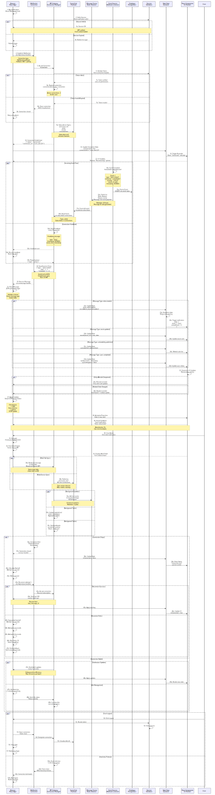

# Real-Time Updates Flow (WebSocket/SSE)

## Overview

This diagram illustrates how Nexus UI delivers real-time security updates to connected clients using WebSocket and Server-Sent Events (SSE). It demonstrates connection establishment, event subscription, message routing, and UI state synchronization with reconnection resilience and multi-device support.

## Sequence Diagram

```mermaid
sequenceDiagram
    participant Browser as Browser<br/>(React App)
    participant WS as WebSocket<br/>Connection
    participant Gateway as API Gateway<br/>(Connection Manager)
    participant Hub as Event Hub<br/>(Pub/Sub)
    participant Queue as Message Queue<br/>(Redis Streams)
    participant EventSrc as Event Sources<br/>(Webhook Listeners)
    participant DB as Database<br/>(PostgreSQL)
    participant Auth as Session<br/>Validation
    participant Store as State Store<br/>(Zustand)
    participant UI as React Components<br/>(UI Render)

    Browser->>Browser: 1. App Initialization<br/>Mount WebSocket hook

    Browser->>Auth: 2. Verify Session<br/>Check auth token valid
    alt Session Valid
        Auth-->>Browser: 3a. Session OK
        Note over Auth,Browser: JWT verified,<br/>User context loaded
    else Session Expired
        Auth-->>Browser: 3b. Redirect to Login
        Browser->>Browser: Redirect /login
    end

    Browser->>WS: 4. Establish WebSocket<br/>ws://api.nexus.local/ws
    Note over Browser,WS: Connection type:<br/>WebSocket preferred<br/>Fallback: SSE + polling

    WS->>Gateway: 5. Accept Connection<br/>Handshake

    Gateway->>Auth: 6. Validate Token<br/>from connection headers
    alt Token Valid
        Auth-->>Gateway: 7a. Token verified<br/>user_id, permissions
        Gateway->>Gateway: 8a. Register connection<br/>connections[user_id] = connection
        Note over Gateway: Active connections: 3<br/>for this user
    else Token Invalid/Expired
        Auth-->>Gateway: 7b. Token invalid
        Gateway-->>WS: 8b. Close connection<br/>4001 Unauthorized
        WS-->>Browser: 9b. Connection closed
        Browser->>Browser: Retry with refresh
    end

    Gateway->>Hub: 9a. Subscribe to Topics<br/>user:{user_id}<br/>alerts<br/>assets<br/>vulnerabilities
    Note over Gateway,Hub: Subscribe to all<br/>relevant channels

    Gateway-->>Browser: 10. Connection Established<br/>{"status": "connected",<br/>"connection_id": "conn_abc123"}

    Browser->>Store: 11. Update Connection State<br/>isConnected = true<br/>connectionId = "conn_abc123"
    Store->>UI: 12. Trigger Re-render<br/>Show "Connected" indicator
    UI-->>Browser: 13. UI Updates<br/>Remove "Reconnecting" spinner

    par Incoming Event Flow
        EventSrc->>EventSrc: 14a. Event Generated<br/>(Crowdstrike alert detected)
        Note over EventSrc: Event: {<br/>  type: "alert.created",<br/>  connector: "crowdstrike",<br/>  severity: "critical",<br/>  asset_id: uuid,<br/>  timestamp: ISO8601<br/>}

        EventSrc->>DB: 15a. Persist Event<br/>INSERT into alerts table

        EventSrc->>Queue: 16a. Publish to<br/>Redis Streams<br/>Stream: events<br/>Message: full event payload
        Note over EventSrc,Queue: Retention: 24 hours<br/>Message ID auto-generated

        Queue->>Hub: 17a. Event delivered<br/>to pub/sub subscribers

        Hub->>Gateway: 18a. Route Event<br/>to subscribed connections
        Note over Hub,Gateway: Topic: alerts<br/>Subscribers: 5 connections

    and Connection Heartbeat
        Gateway->>Gateway: 14b. Send Heartbeat<br/>every 30 seconds
        Note over Gateway: Heartbeat message:<br/>{<br/>  type: "ping",<br/>  timestamp: ISO8601,<br/>  server_time: timestamp<br/>}

        Gateway-->>Browser: 15b. Heartbeat sent

        Browser->>Browser: 16b. Receive heartbeat<br/>Reset idle timer

        Browser-->>Gateway: 17b. Pong response<br/>{"type": "pong"}
    end

    Gateway->>WS: 19. Send Event to Client<br/>{"type": "alert.created",<br/>"data": {...},<br/>"metadata": {...}}
    Note over Gateway,WS: Serialized to JSON<br/>Compression: gzip<br/>Size: 2.5 KB

    WS-->>Browser: 20. Receive Message<br/>via onmessage handler

    Browser->>Browser: 21. Parse Message<br/>JSON.parse(message)
    Note over Browser: Validate schema<br/>Check message type<br/>Extract data

    alt Message Type: alert.created
        Browser->>Store: 22a. Update Store<br/>alerts.add(newAlert)<br/>recentAlerts.prepend(newAlert)
        Store->>Store: 23a. Normalize data<br/>Merge with existing
        Store->>UI: 24a. Trigger notification<br/>state: {<br/>  alerts: [...new],<br/>  unreadCount: +1<br/>}
    else Message Type: asset.updated
        Browser->>Store: 22b. Update Store<br/>assets[asset_id] = new_data
        Store->>UI: 24b. Update asset card
    else Message Type: vulnerability.published
        Browser->>Store: 22c. Update Store<br/>vulnerabilities.add(newVuln)
        Store->>UI: 24c. Refresh vuln list
    else Message Type: sync.completed
        Browser->>Store: 22d. Update Store<br/>lastSyncTime = timestamp<br/>syncInProgress = false
        Store->>UI: 24d. Update sync status
    end

    UI->>UI: 25. Determine UI Updates<br/>Memoization checks
    alt Only Affected Component
        UI->>Browser: 26a. Minimal re-render<br/>Only alert card updates
    else Related Data Changed
        UI->>Browser: 26b. Broader re-render<br/>Dashboard + sidebar update
    end

    Browser->>Browser: 27. Apply Updates<br/>Virtual DOM reconciliation
    Note over Browser: Old alert list<br/>↓ (diff)<br/>New alert list<br/>↓ (patch)<br/>DOM update

    Browser->>UI: 28. Animation/Transition<br/>Slide in new alert
    UI-->>Browser: 29. Visual Feedback<br/>Toast notification:<br/>"New critical alert"
    Note over UI,Browser: Auto-dismiss: 5s<br/>Can click for details

    User->>Browser: 30. User Action<br/>Click alert notification
    Browser->>Browser: 31. Navigate<br/>History.push(/alerts/123)
    Browser->>Browser: 32. Fetch Alert Details<br/>Query store or API
    UI-->>Browser: 33. Display Alert Detail<br/>Full context shown

    par Multi-Tab Sync
        Browser->>Gateway: 34a. Broadcast message<br/>to other tabs<br/>(BroadcastChannel API)
        Note over Browser,Gateway: Same origin tabs<br/>share state via BC
    and Multi-Device Sync
        Gateway->>Hub: 34b. Publish to<br/>user:{user_id}:*<br/>All user connections
        Note over Gateway,Hub: Sync across devices<br/>Web, mobile, desktop
    end

    par Background Updates
        Gateway->>Queue: 35a. Archive events<br/>to long-term storage<br/>(ClickHouse)
        Note over Gateway,Queue: Historical analytics<br/>Retention: 2 years
    and Background Tasks
        Gateway->>Gateway: 35b. Update materialized<br/>views in database<br/>Aggregation tables
    and Background Tasks
        Gateway->>Gateway: 35c. Send webhooks<br/>to external systems<br/>(Slack, email, etc)
    end

    alt Connection Drops
        WS->>WS: 36a. Connection Error<br/>Network timeout<br/>Server close
        WS-->>Browser: 37a. Connection closed<br/>onclose handler

        Browser->>Store: 38a. Update State<br/>isConnected = false
        Store->>UI: 39a. Show Status<br/>"Connection lost"<br/>spinner visible

        Browser->>Browser: 40a. Calculate Backoff<br/>Attempt 1: 1 second
        Browser->>Browser: 41a. Wait 1 second
        Browser->>WS: 42a. Reconnect attempt 1<br/>ws://api.nexus.local/ws

        alt Reconnect Success
            WS->>Gateway: 43a. Accept connection<br/>Resume subscription
            Gateway->>Browser: 44a. Send last 100<br/>events (catch-up)
            Note over Gateway,Browser: Resume from<br/>last_message_id
            Browser->>Store: 45a. Apply backlog
            Store->>UI: 46a. Update UI<br/>isConnected = true
        else Reconnect Fails
            Browser->>Browser: 43b. Exponential backoff<br/>Attempt 2: 2 seconds
            Browser->>Browser: 44b. Attempt 3: 4 seconds
            Browser->>Browser: 45b. Attempt 4: 8 seconds
            Browser->>Browser: 46b. Max retries (5)<br/>Switch to polling
            Browser->>Browser: 47b. Polling fallback<br/>fetch every 10 seconds
        end
    else Connection Stable
        par Continuous Updates
            Gateway->>Browser: 47a. Send batch updates<br/>every 5 seconds
            Note over Gateway,Browser: Debounced for efficiency<br/>Max 10 events per batch
            Browser->>Store: 48a. Apply updates
            Store->>UI: 49a. Render new state
        and Idle Management
            Browser->>Browser: 47b. Idle detection<br/>> 5 minutes no activity
            Browser->>Gateway: 48b. Send idle status<br/>Reduce priority
            Gateway->>Gateway: 49b. Unsubscribe<br/>non-critical topics
        end
    end

    par User Logout
        User->>Browser: 50. Click Logout
        Browser->>Auth: 51. Revoke token
        Auth->>Auth: 52. Clear session
        Browser->>WS: 53. Close connection<br/>Clean close
        WS->>Gateway: 54. Deregister connection
        Gateway->>Hub: 55. Unsubscribe all
        Browser->>Browser: 56. Clear state
        Browser->>Browser: 57. Redirect to /login
    and Inactivity Timeout
        Gateway->>Gateway: 50b. Check idle time<br/>(>30 min no pong)
        Gateway->>WS: 51b. Force close<br/>4002 Inactivity timeout
        WS-->>Browser: 52b. Connection terminated
        Browser->>Browser: 53b. Auto-logout<br/>Redirect to login
    end
```



<!-- SVG: 05-real-time-updates-1.svg -->



## Connection Types and Fallbacks

### WebSocket Connection (Primary)

```
Advantages:
├─ Full duplex communication
├─ Low latency: 10-50ms
├─ Efficient binary protocol
├─ Server can push anytime
└─ Maintains single connection

WebSocket Handshake:
1. Browser sends HTTP upgrade request
2. Server responds with 101 Switching Protocols
3. Connection upgraded to WebSocket
4. Full duplex stream established

Example:
GET /ws HTTP/1.1
Upgrade: websocket
Connection: Upgrade
Sec-WebSocket-Key: x3JJHMbDL1EzLkh9GBhXDw==
Sec-WebSocket-Version: 13

HTTP/1.1 101 Switching Protocols
Upgrade: websocket
Connection: Upgrade
Sec-WebSocket-Accept: HSmrc0sMlYUkAGmm5OPpG2HaGWk=

Connection established ✓
```

### Server-Sent Events (SSE) Fallback

```
Used when:
├─ WebSocket not supported
├─ Firewall blocks WebSocket
├─ Network restrictions
└─ Compatibility requirement

Advantages:
├─ HTTP-based (firewall friendly)
├─ Automatic reconnect
├─ Built-in event format
└─ Good browser support

Disadvantages:
├─ Unidirectional (server → client only)
├─ Higher latency: 100-500ms
├─ More HTTP overhead
└─ 6 connections per domain limit

Example Event Stream:
event: alert
data: {"id":"123","severity":"critical"}

event: sync
data: {"status":"completed","records":1000}

reconnect: 5000
```

### Long Polling (Last Resort)

```
Used when:
├─ WebSocket + SSE both blocked
├─ Very old browser
├─ Network very restrictive
└─ Fallback to HTTP POST only

Polling Interval:
├─ Default: 10 seconds
├─ Can increase to 30s if idle
├─ Battery mode: 60 seconds
└─ Resume to 10s on activity

Polling Request:
POST /api/updates
{
  "last_message_id": "msg_12345",
  "subscriptions": ["alerts", "assets"]
}

Response:
{
  "messages": [
    {event: "alert.created", data: {...}},
    {event: "asset.updated", data: {...}}
  ],
  "last_message_id": "msg_12346"
}
```

### Connection Decision Tree

```
Browser connects:
│
├─ WebSocket supported? (Check window.WebSocket)
│  ├─ YES → Try WebSocket
│  │  ├─ SUCCESS → Use WebSocket ✓
│  │  └─ TIMEOUT/ERROR → Fallback to SSE
│  │
│  └─ NO → Skip to SSE check
│
├─ SSE supported? (Check window.EventSource)
│  ├─ YES → Try SSE
│  │  ├─ SUCCESS → Use SSE ✓
│  │  └─ ERROR → Fallback to polling
│  │
│  └─ NO → Skip to polling
│
└─ Use Long Polling as fallback ✓

Connection Quality Monitoring:
├─ Latency: Average < 100ms → Good
├─ Latency: 100-500ms → Fair
├─ Latency: > 500ms → Poor
├─ Packet loss: < 1% → Good
└─ Reconnect frequency: < 1/min → Good
```

## Event Types and Payloads

### Alert Events

```json
{
  "type": "alert.created",
  "event_id": "evt_12345",
  "timestamp": "2024-01-15T14:23:45Z",
  "data": {
    "id": "alert_789",
    "title": "Suspicious Process Detected",
    "severity": "critical",
    "source": "crowdstrike",
    "asset_id": "asset_123",
    "asset_name": "prod-web-01",
    "description": "Unusual process execution detected",
    "indicators": [
      "parent_process: explorer.exe",
      "target_process: powershell.exe",
      "command_line: 'iex(New-Object Net.WebClient)...'"
    ]
  },
  "metadata": {
    "source_connector": "crowdstrike",
    "correlation_id": "corr_456",
    "confidence": 0.95,
    "rule_id": "rule_escalation_001"
  }
}
```

### Asset Update Events

```json
{
  "type": "asset.updated",
  "event_id": "evt_12346",
  "timestamp": "2024-01-15T14:24:00Z",
  "data": {
    "id": "asset_123",
    "name": "prod-web-01",
    "changes": {
      "status": {
        "old": "online",
        "new": "offline"
      },
      "last_patched": {
        "old": "2024-01-01T00:00:00Z",
        "new": "2024-01-15T14:00:00Z"
      }
    }
  },
  "metadata": {
    "change_source": "patch_management",
    "changed_by": "automation"
  }
}
```

### Vulnerability Events

```json
{
  "type": "vulnerability.published",
  "event_id": "evt_12347",
  "timestamp": "2024-01-15T14:25:00Z",
  "data": {
    "cve_id": "CVE-2024-1234",
    "title": "Critical RCE in Apache Log4j",
    "cvss_score": 9.8,
    "affected_assets": [
      "asset_123",
      "asset_456"
    ],
    "exploit_available": true,
    "in_the_wild": true
  },
  "metadata": {
    "source": "nvd",
    "published_date": "2024-01-15T00:00:00Z"
  }
}
```

### Sync Events

```json
{
  "type": "sync.completed",
  "event_id": "evt_12348",
  "timestamp": "2024-01-15T14:30:00Z",
  "data": {
    "connector_id": "crowdstrike-prod",
    "connector_name": "CrowdStrike Falcon",
    "status": "success",
    "statistics": {
      "records_processed": 500,
      "records_new": 45,
      "records_updated": 120,
      "duration_ms": 47300
    }
  },
  "metadata": {
    "sync_id": "sync_12345",
    "next_sync_at": "2024-01-15T14:45:00Z"
  }
}
```

## Message Routing and Filtering

### Subscription Model

```
User subscribes to topics based on permissions:

User: john.doe@company.com
Permissions: view_assets, view_alerts, manage_team
Subscriptions:
├─ alerts           (has view_alerts)
├─ assets           (has view_assets)
├─ users            (has manage_team)
├─ team_.*          (has manage_team)
└─ user:{user_id}   (personal notifications)

Cannot subscribe to:
├─ admin:*          (no admin permission)
├─ billing:*        (no billing permission)
└─ secrets:*        (no secrets permission)

Topic Patterns:
alerts              All alerts
alerts:critical     Only critical severity
alerts:cs:prod      Crowdstrike alerts in prod
assets:all          All asset changes
assets:{asset_id}   Changes to specific asset
vulnerabilities     New vulnerabilities
sync:*              All sync events
```

### Permission-Based Filtering

```
Incoming Event:
{
  "type": "alert.created",
  "asset_id": "asset_prod_123",
  "team_id": "team_abc"
}

User: john.doe
Permissions: view_alerts, view_assets (prod only)
Team: team_abc (member)

Filtering Rules:
1. Has view_alerts permission? YES → continue
2. Can access asset prod_123?
   - Asset.team_id = team_abc
   - User.team_id = team_abc
   - Match → YES → continue
3. All checks passed → Send event

If denied:
- Silently drop event
- Don't notify user
- Log attempt
```

## State Management (Zustand)

### Store Structure

```typescript
interface UIState {
  // Connection
  connection: {
    status: 'connected' | 'connecting' | 'disconnected';
    connectionId: string;
    lastConnected: ISO8601DateTime;
    messageCount: number;
  };

  // Recent Events
  recentAlerts: Alert[];      // Last 50 alerts
  recentAssets: Asset[];      // Last 20 asset changes
  syncStatus: SyncStatus[];   // Last 10 syncs

  // Counters
  unreadAlerts: number;
  totalAlertsToday: number;
  criticalCount: number;

  // UI State
  showNotifications: boolean;
  notificationSound: boolean;
  updateIndicators: Map<string, boolean>; // What changed

  // Functions
  addAlert: (alert: Alert) => void;
  updateAsset: (asset: Asset) => void;
  clearAlerts: () => void;
  setConnected: (connected: boolean) => void;
}

Store Creation:
const useUIStore = create<UIState>((set) => ({
  connection: {
    status: 'disconnected',
    connectionId: '',
    lastConnected: new Date(),
    messageCount: 0
  },

  addAlert: (alert) => set((state) => ({
    recentAlerts: [alert, ...state.recentAlerts].slice(0, 50),
    unreadAlerts: state.unreadAlerts + 1,
    criticalCount: alert.severity === 'critical'
      ? state.criticalCount + 1
      : state.criticalCount
  }))
}));
```

## Reconnection Strategy

### Exponential Backoff Algorithm

```
Attempt 1: Retry immediately
Attempt 2: Wait 1 second
Attempt 3: Wait 2 seconds
Attempt 4: Wait 4 seconds
Attempt 5: Wait 8 seconds
Attempt 6: Wait 16 seconds
Attempt 7: Wait 32 seconds
Attempt 8: Wait 64 seconds (max)
Attempt 9+: Keep trying every 64 seconds

Backoff Calculation:
delay_ms = Math.min(
  initial_delay * (2 ^ (attempt - 1)),
  max_delay
)
+ random_jitter (0-1000ms)

Example:
Attempt 1: 0ms (immediate)
Attempt 2: 1000ms + 234ms jitter = 1234ms
Attempt 3: 2000ms + 567ms jitter = 2567ms
Attempt 4: 4000ms + 891ms jitter = 4891ms
...
Attempt 8: 64000ms (cap reached)
```

### Catch-Up Logic

```
Scenario: Connection lost for 5 minutes
Events received while offline: 1000+

On Reconnection:
1. Send reconnect request with:
   - last_message_id: "msg_12345"
   - subscriptions: ["alerts", "assets"]

2. Server sends catch-up:
   - Event window: 5 minutes
   - Max events: 100 (cap)
   - Compress: aggregate related changes

3. Client applies backlog:
   - For each event: update store
   - Batch UI updates for efficiency
   - Merge with live events

4. Display notification:
   - "Synced 47 events from offline period"
   - Show summary: "5 new alerts, 3 updated assets"
   - Option to review all
```

## Performance Optimization

### Message Batching

```
Without Batching:
├─ Event 1 → Send immediately → UI update → render
├─ Event 2 → Send immediately → UI update → render
├─ Event 3 → Send immediately → UI update → render
└─ Event 4 → Send immediately → UI update → render
Result: 4 renders per second (expensive)

With Batching (5ms window):
├─ Event 1 → Queue
├─ Event 2 → Queue
├─ Event 3 → Queue
├─ Event 4 → Queue
└─ After 5ms: Send batch → Single UI update → 1 render
Result: Efficient batch processing

Configuration:
- Batch window: 5-50ms
- Max batch size: 10 events
- Adaptive: Increase window if events arriving slowly
- Flush on: alert.critical (urgent events)
```

### Selective Updates

```
Event: asset.updated
Asset: prod-web-01
Changes: status (online → offline)

Components affected:
├─ AssetList: May need re-render
├─ AssetDetail: Will re-render if viewing prod-web-01
├─ Dashboard: May need re-render
├─ Sidebar: No change
└─ Header: No change

Optimization: Only re-render affected components
- Memoization prevents unnecessary renders
- Selector functions return same object if value unchanged
- Zustand only notifies subscribers of changed slice
```

## Monitoring and Observability

### Connection Metrics

```
Metrics Collected:
- Active connections per user
- Message throughput (msg/sec)
- Latency distribution (p50, p95, p99)
- Error rates per type
- Reconnection frequency
- Message queue depth
- Subscriber count per topic

Alerting Thresholds:
- P95 latency > 1000ms → Warning
- Error rate > 1% → Alert
- Reconnect rate > 1/min per user → Investigate
- Queue depth > 10000 → Page on-call
```

### Event Loss Prevention

```
Safeguards:
1. Message Queue Durability
   - Redis Streams with persistence
   - Retention: 24 hours minimum

2. Acknowledgment Protocol
   - Client ack each event received
   - Server retransmits on timeout

3. Sequence Numbers
   - Each event has sequence ID
   - Client detects missing IDs
   - Requests gap fill from server

4. Fallback Polling
   - If connection unstable, polling backup
   - Syncs missed events
   - Higher latency but guaranteed delivery

Missing Event Recovery:
1. Client detects gap: seq 100 → seq 102
2. Request: fetch_events(start=100, end=102)
3. Server sends: events 100, 101, 102
4. Client applies backlog
5. Resume normal streaming
```

## Browser Compatibility

### WebSocket Support

```
Full Support (WebSocket):
├─ Chrome 16+
├─ Firefox 11+
├─ Safari 7+
├─ Edge 12+
├─ Opera 12.1+
└─ IE 10+

Partial Support (SSE):
├─ Chrome 6+
├─ Firefox 6+
├─ Safari 5.1+
└─ (IE: Not supported)

Fallback Chain:
1. Try WebSocket
2. Fall back to SSE
3. Fall back to polling
4. Last resort: Manual refresh
```

## Security Considerations

### Connection Security

```
Measures:
1. Authentication
   - JWT token in connection header
   - Validate before accepting

2. Authorization
   - Check permissions for each topic
   - Filter events based on user ACLs

3. Encryption
   - TLS for WebSocket (wss://)
   - HTTPS for SSE fallback

4. Rate Limiting
   - Max 1000 messages/min per user
   - Max 10 subscriptions per connection
   - Max 100 concurrent connections

5. Input Validation
   - Validate all user-provided filters
   - Sanitize subscription topics
   - Prevent SQL/code injection
```

### Message Validation

```
Incoming Message Checks:
1. Message size < 1MB
2. Valid JSON structure
3. Required fields present
4. Event type valid
5. Message type valid
6. Data schema matches type

Invalid Message Handling:
├─ Log with details
├─ Increment error counter
├─ Disconnect after 5 errors
└─ Alert security team if pattern
```

## Performance Targets

| Metric | Target | Notes |
|--------|--------|-------|
| Connection Establishment | <500ms | Include auth |
| Message Latency | <100ms | P95 WebSocket |
| Reconnect Time | <2000ms | With exponential backoff |
| Message Throughput | >1000/sec | Per server |
| CPU per Connection | <10ms | Idle state |
| Memory per Connection | <100KB | Session state |
| Event Processing | <10ms | Parse + store |
| UI Update | <50ms | Re-render |

## Related Diagrams

- [Dashboard Request Flow](./01-dashboard-request.md) - Initial data load
- [System Architecture](../architecture/01-system-architecture.md) - WebSocket server design

## Additional Resources

- [WebSocket Protocol (RFC 6455)](https://tools.ietf.org/html/rfc6455)
- [Server-Sent Events Standard](https://html.spec.whatwg.org/multipage/server-sent-events.html)
- [Socket.io Library](https://socket.io/)
- [React Hooks for WebSocket](https://github.com/useSync/react-use-websocket)
- [Redux Real-Time Patterns](https://redux.js.org/usage/patterns)
