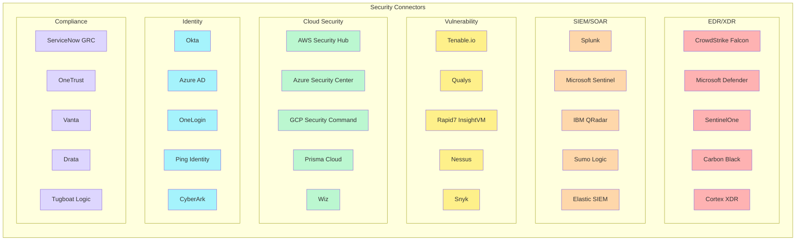
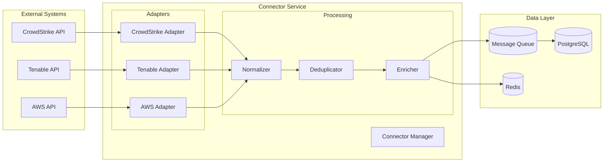
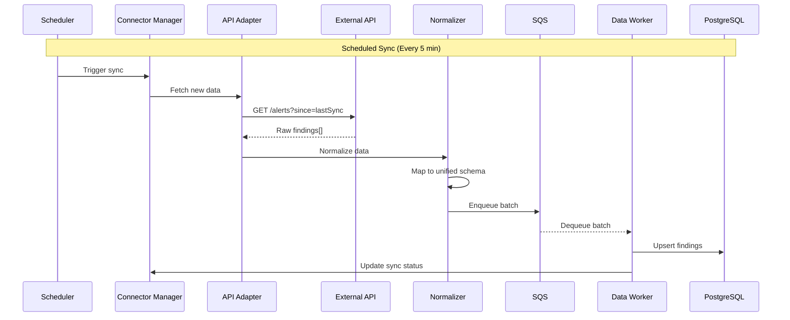
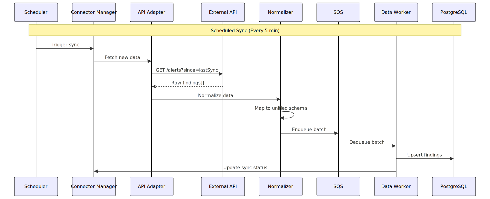
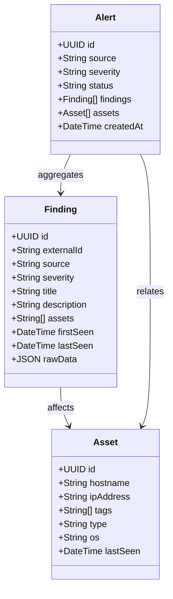
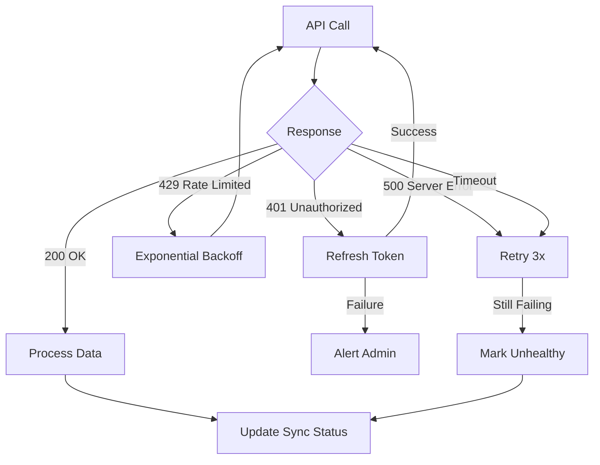

# Connector Catalog

## Connector Categories



<!-- SVG: 01-connector-catalog-1.svg -->



## Connector Architecture



<!-- SVG: 01-connector-catalog-2.svg -->



## Connector Data Flow



<!-- SVG: 01-connector-catalog-3.svg -->



## Unified Data Model



<!-- SVG: 01-connector-catalog-4.svg -->



## Connector Status Dashboard

| Connector | Sync Frequency | Last Sync | Status | Findings |
|-----------|----------------|-----------|--------|----------|
| CrowdStrike | 5 min | 2 min ago | ✅ Active | 1,234 |
| Tenable.io | 15 min | 5 min ago | ✅ Active | 45,678 |
| AWS Security Hub | 10 min | 3 min ago | ✅ Active | 892 |
| Splunk | 5 min | 1 min ago | ✅ Active | 23,456 |
| Okta | 30 min | 10 min ago | ⚠️ Rate Limited | 156 |
| Azure AD | 60 min | 45 min ago | ✅ Active | 2,341 |

## Error Handling



<!-- SVG: 01-connector-catalog-5.svg -->



## Connector Configuration

```typescript
interface ConnectorConfig {
  id: string;
  type: 'crowdstrike' | 'tenable' | 'aws' | 'splunk' | /* ... */;
  name: string;
  credentials: {
    type: 'api_key' | 'oauth2' | 'aws_role';
    // Encrypted storage
  };
  sync: {
    frequency: number; // minutes
    fullSyncFrequency: number; // hours
    batchSize: number;
    timeout: number;
  };
  filters: {
    severity?: string[];
    assetTags?: string[];
    dateRange?: { start: Date; end: Date };
  };
  mapping: {
    severityMap: Record<string, string>;
    statusMap: Record<string, string>;
    customFields: Record<string, string>;
  };
}
```
