# Authentication Flow

## OAuth 2.0 / OIDC Login Flow

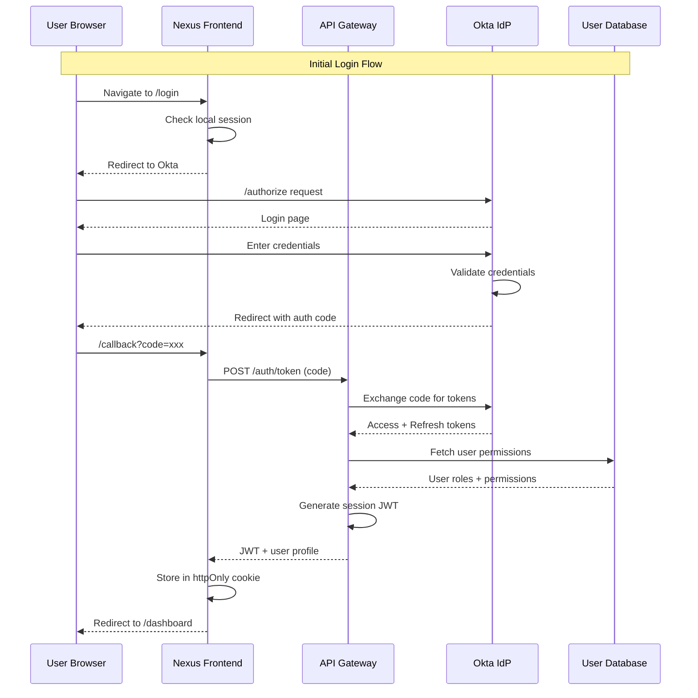

<!-- SVG: 01-auth-flow-1.svg -->
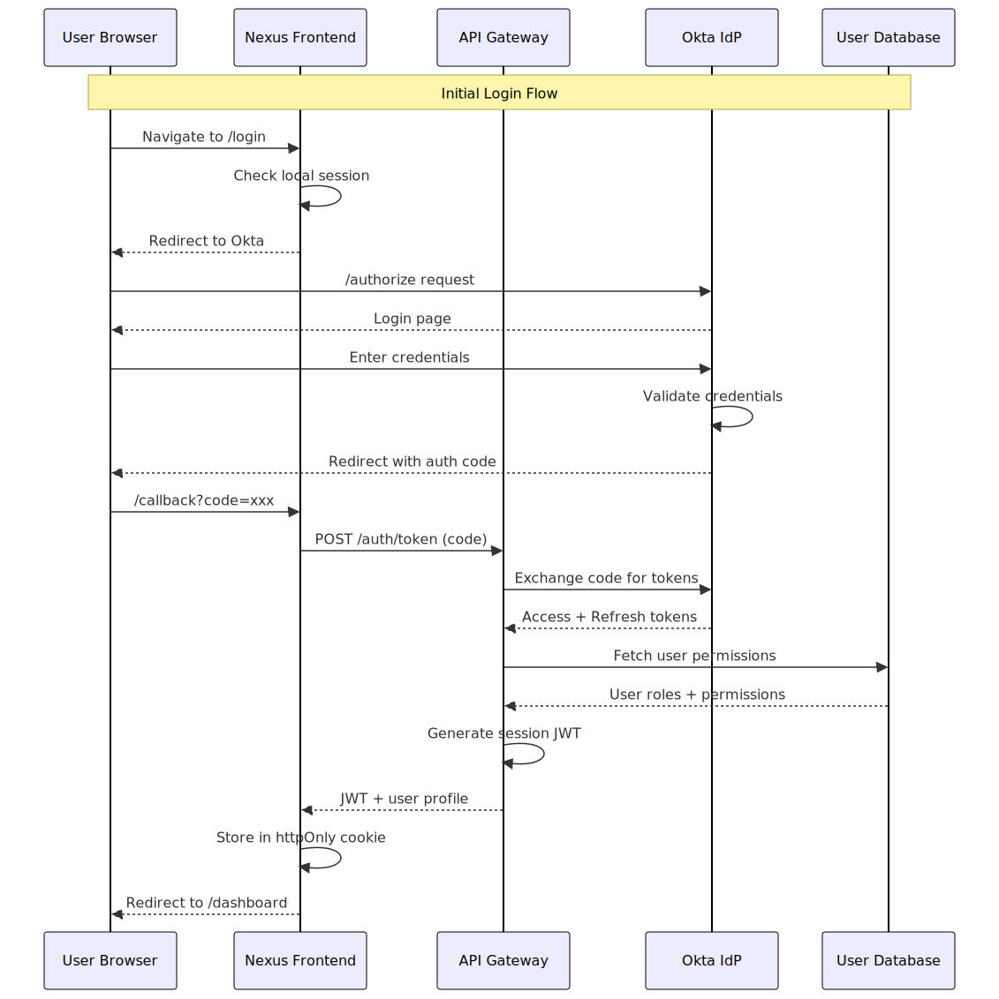

## Token Refresh Flow

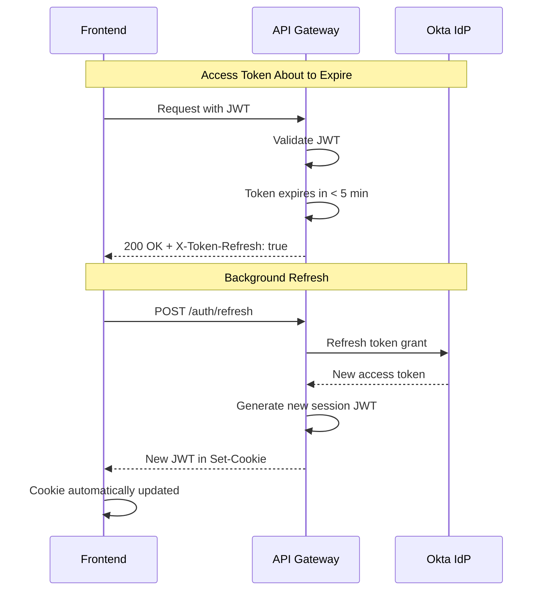

<!-- SVG: 01-auth-flow-2.svg -->
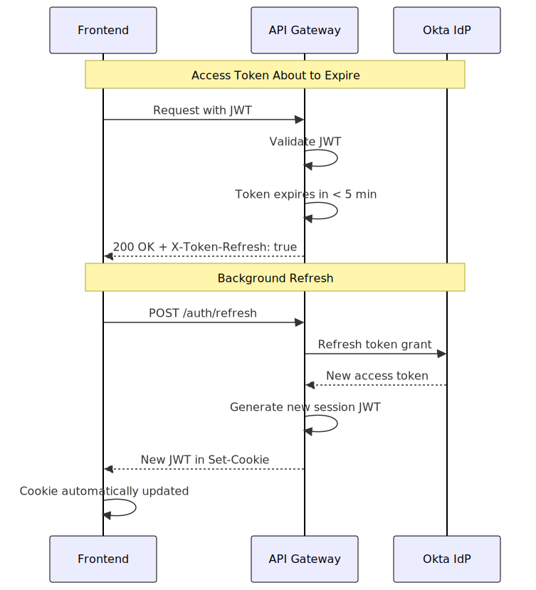

## Session Validation

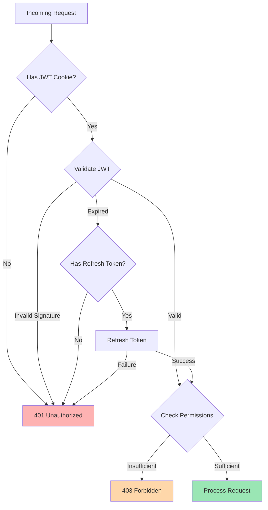

<!-- SVG: 01-auth-flow-3.svg -->

## Logout Flow

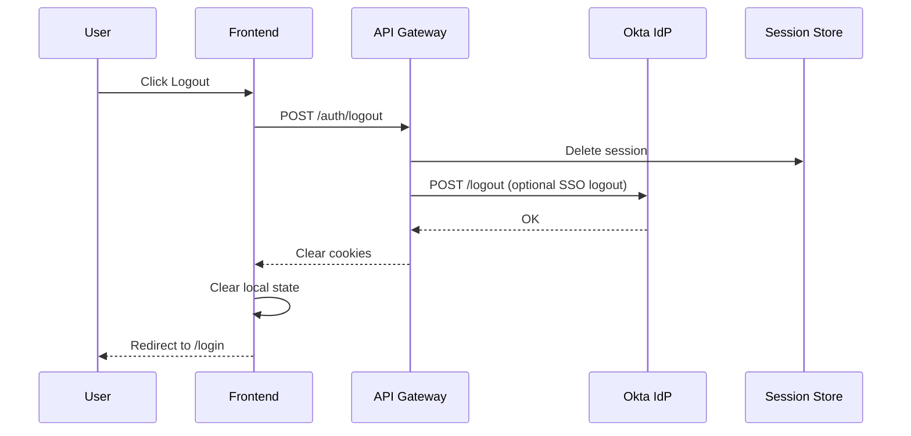

<!-- SVG: 01-auth-flow-4.svg -->
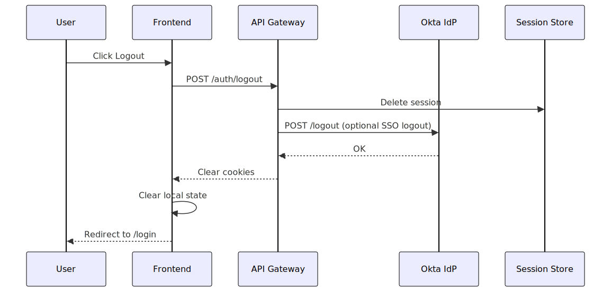

## Security Headers

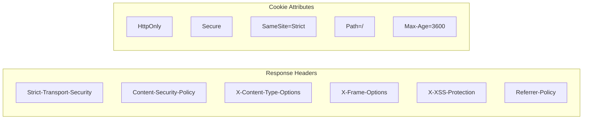

<!-- SVG: 01-auth-flow-5.svg -->

## Multi-Factor Authentication

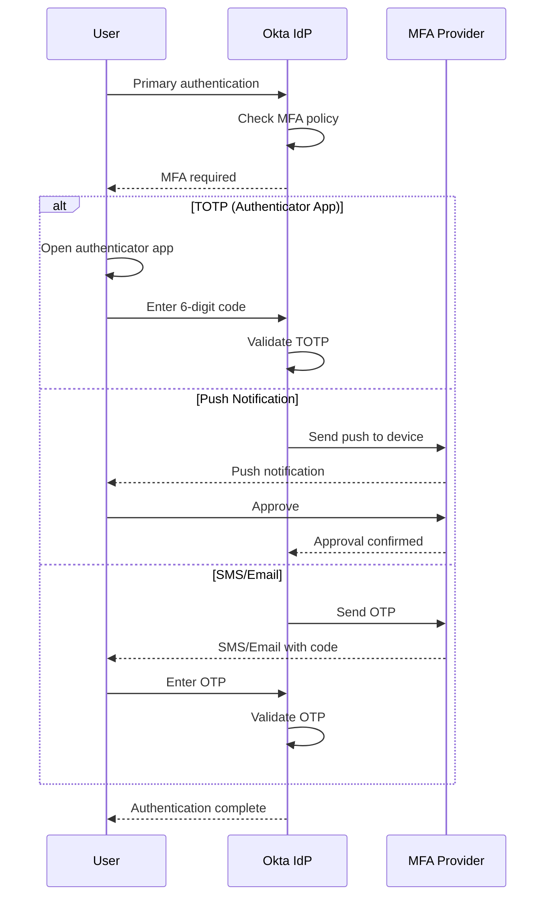

<!-- SVG: 01-auth-flow-6.svg -->
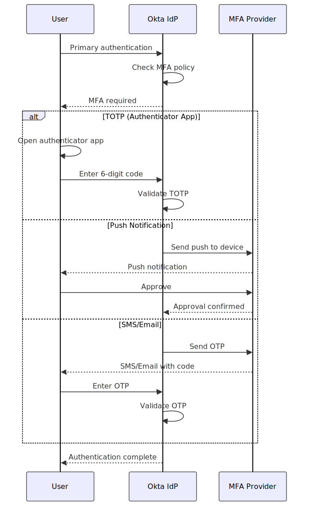

## Security Controls Summary

| Control | Implementation | Status |
|---------|----------------|--------|
| HTTPS Only | HSTS header, redirect | Required |
| JWT Signing | RS256 asymmetric | Required |
| Token Expiry | 1 hour access, 7 day refresh | Required |
| Session Storage | Redis with encryption | Required |
| CSRF Protection | SameSite cookies | Required |
| Rate Limiting | Kong Gateway | Required |
| MFA | Okta Verify / TOTP | Required |
| SSO | SAML 2.0 / OIDC | Supported |
