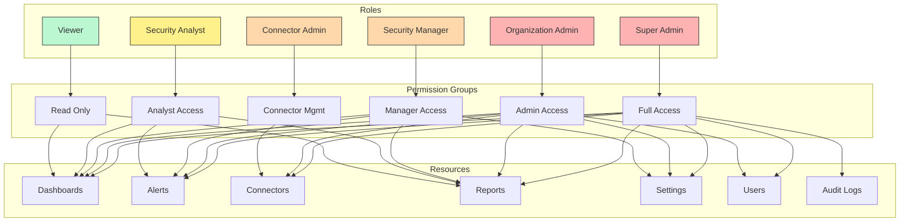
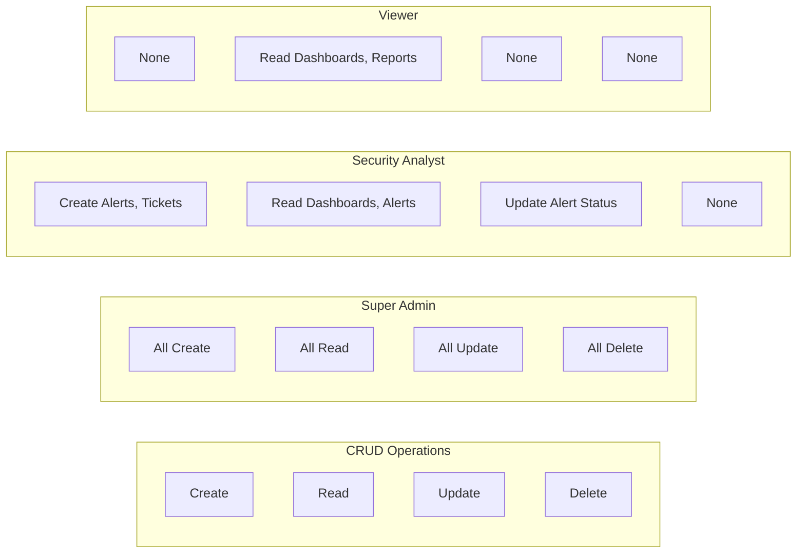
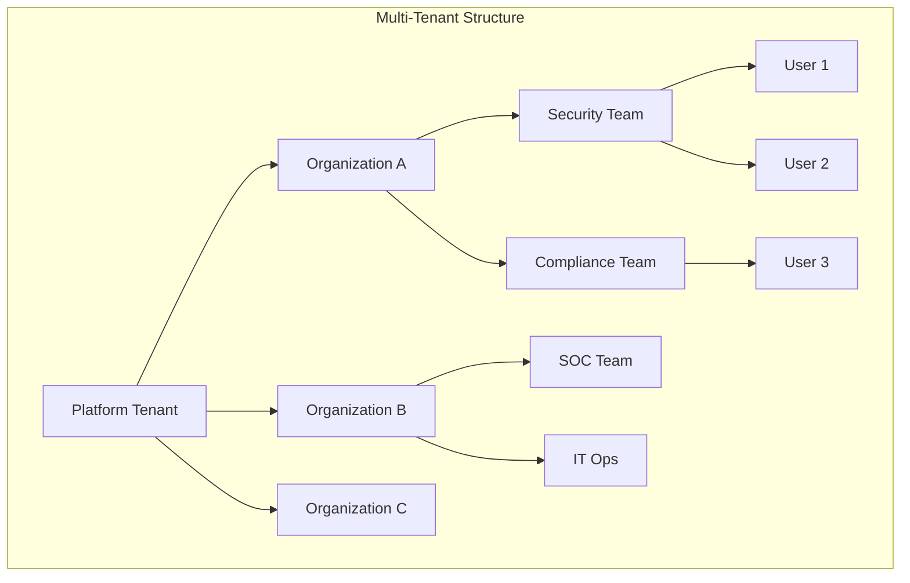
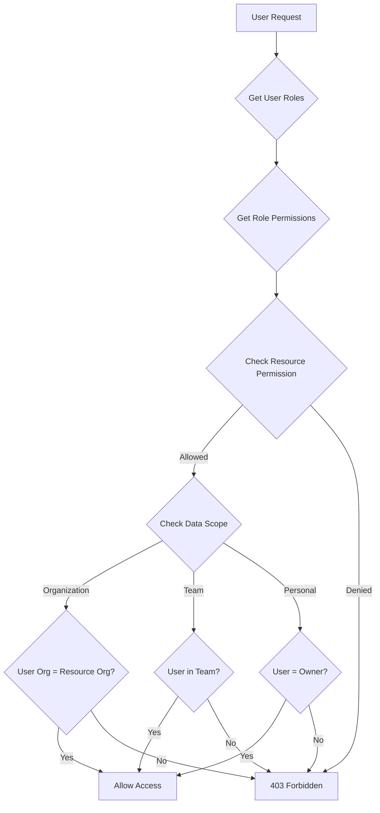
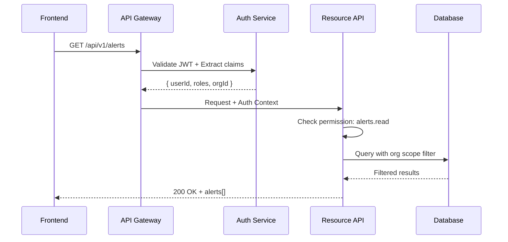
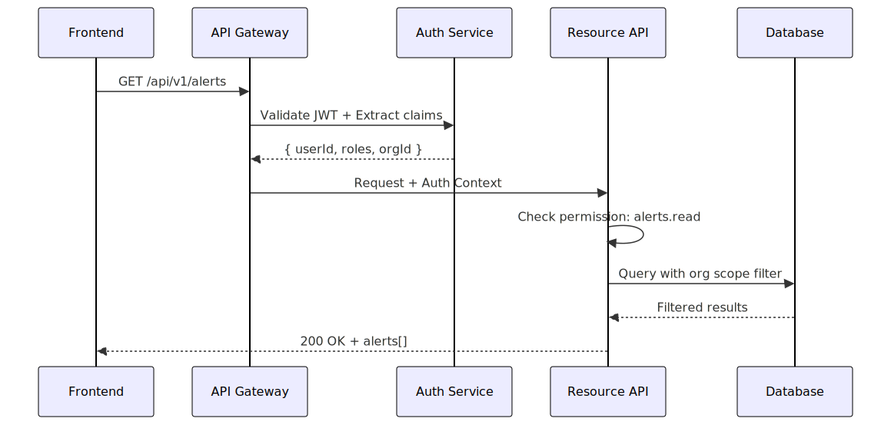

# Role-Based Access Control (RBAC) Model

## Permission Hierarchy



<!-- SVG: 02-rbac-model-1.svg -->



## Permission Matrix



<!-- SVG: 02-rbac-model-2.svg -->



## Role Definitions

| Role | Description | Scope |
|------|-------------|-------|
| Super Admin | Platform-wide administration | All organizations |
| Organization Admin | Full org control | Single organization |
| Security Manager | Manages analysts, workflows | Assigned teams |
| Security Analyst | Day-to-day operations | Assigned dashboards |
| Viewer | Read-only dashboards | Assigned dashboards |
| Connector Admin | Manage integrations | Connector resources |

## Organization Hierarchy



<!-- SVG: 02-rbac-model-3.svg -->



## Permission Resolution



<!-- SVG: 02-rbac-model-4.svg -->



## API Authorization



<!-- SVG: 02-rbac-model-5.svg -->



## Permission Definitions

```typescript
// Permission structure
interface Permission {
  resource: 'alerts' | 'dashboards' | 'connectors' | 'users' | 'settings';
  action: 'create' | 'read' | 'update' | 'delete' | 'manage';
  scope?: 'own' | 'team' | 'organization' | 'platform';
}

// Role mappings
const ROLES = {
  'super-admin': ['*:*:platform'],
  'org-admin': ['*:*:organization'],
  'security-manager': [
    'alerts:*:team',
    'dashboards:*:team',
    'reports:*:team',
    'users:read:team'
  ],
  'security-analyst': [
    'alerts:read:team',
    'alerts:update:own',
    'dashboards:read:team',
    'reports:read:team'
  ],
  'viewer': [
    'dashboards:read:own',
    'reports:read:own'
  ]
};
```

## Audit Trail

| Event | Logged Data | Retention |
|-------|-------------|-----------|
| Login | userId, IP, timestamp, success | 1 year |
| Permission denied | userId, resource, action, reason | 1 year |
| Role change | userId, oldRole, newRole, changedBy | 3 years |
| Data export | userId, dataType, recordCount | 3 years |
| Setting change | userId, setting, oldValue, newValue | 3 years |
