# MCP Security Model

## Overview

This diagram documents the security architecture for the Model Context Protocol (MCP) integration, covering authentication, authorization, and data protection for AI assistant access to the Armor platform.

## Security Architecture Overview

```mermaid
graph TB
    subgraph "Threat Surface"
        TS1[Unauthorized Access<br/>Stolen credentials]
        TS2[Data Exfiltration<br/>Sensitive data exposure]
        TS3[Privilege Escalation<br/>Unauthorized operations]
        TS4[API Abuse<br/>Rate limit bypass]
        TS5[Injection Attacks<br/>Malicious tool input]
    end

    subgraph "Defense Layers"
        subgraph "Layer 1: Transport"
            T1[TLS 1.3 Encryption]
            T2[Process Isolation<br/>STDIO]
            T3[Network Segmentation]
        end

        subgraph "Layer 2: Authentication"
            A1[OAuth2 Client Credentials]
            A2[Token Validation<br/>JWT RS256]
            A3[Token Rotation<br/>Short-lived tokens]
        end

        subgraph "Layer 3: Authorization"
            Z1[RBAC Permission Check]
            Z2[Scope Validation]
            Z3[Resource-Level Access]
        end

        subgraph "Layer 4: Input Validation"
            V1[Schema Validation<br/>JSON Schema]
            V2[Parameter Sanitization]
            V3[Query Limits<br/>Max results]
        end

        subgraph "Layer 5: Rate Limiting"
            R1[Per-User Quotas]
            R2[Per-Tool Limits]
            R3[Burst Protection]
        end

        subgraph "Layer 6: Audit"
            AU1[Tool Invocation Logs]
            AU2[Access Audit Trail]
            AU3[Anomaly Detection]
        end
    end

    TS1 --> T1
    TS1 --> A1
    TS2 --> Z1
    TS2 --> AU1
    TS3 --> Z1
    TS3 --> Z2
    TS4 --> R1
    TS5 --> V1

    classDef threat fill:#FEB2B2,stroke:#333
    classDef defense fill:#68D391,stroke:#333

    class TS1,TS2,TS3,TS4,TS5 threat
    class T1,T2,T3,A1,A2,A3,Z1,Z2,Z3,V1,V2,V3,R1,R2,R3,AU1,AU2,AU3 defense
```

<!-- SVG: 03-mcp-security-model-1.svg -->

## Authentication Architecture

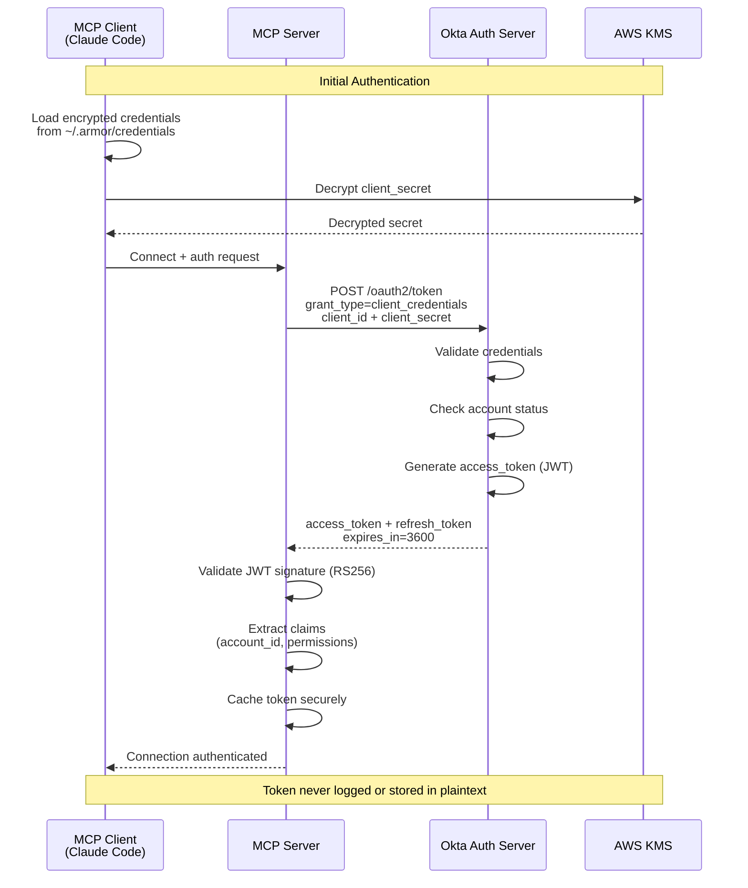

<!-- SVG: 03-mcp-security-model-2.svg -->
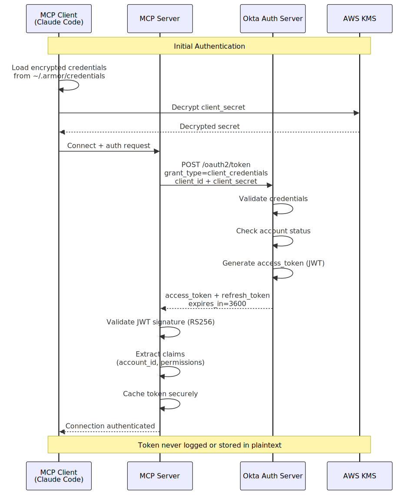

## Permission Model

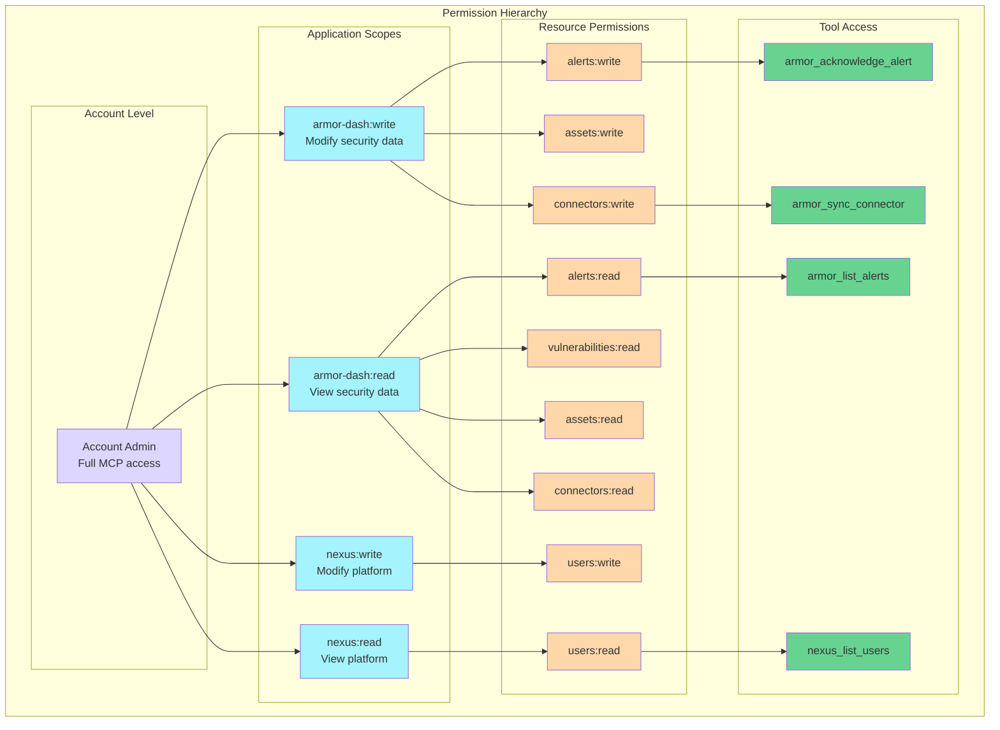

<!-- SVG: 03-mcp-security-model-3.svg -->

## Authorization Flow

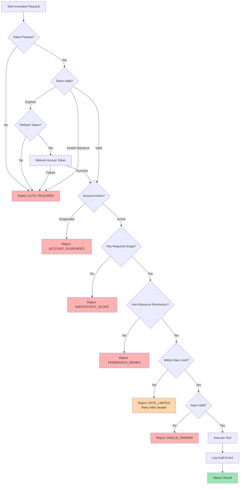

<!-- SVG: 03-mcp-security-model-4.svg -->

## Input Validation

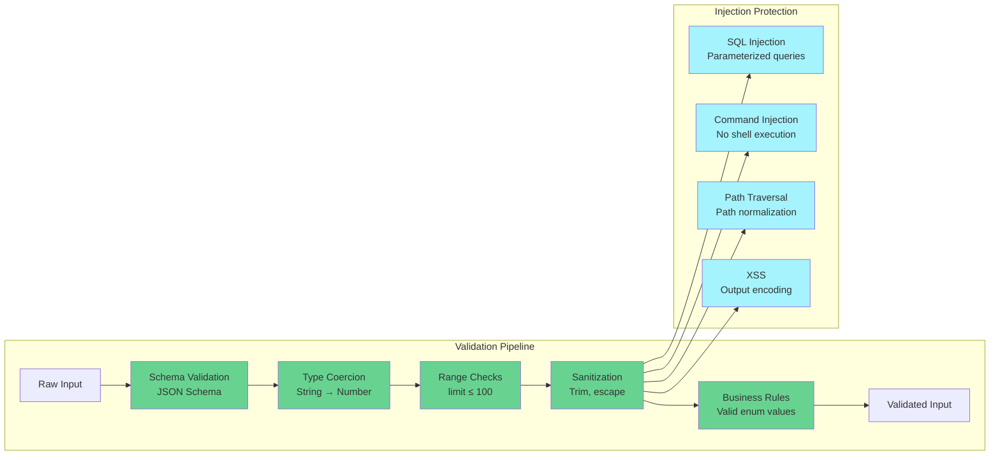

<!-- SVG: 03-mcp-security-model-5.svg -->

## Data Protection

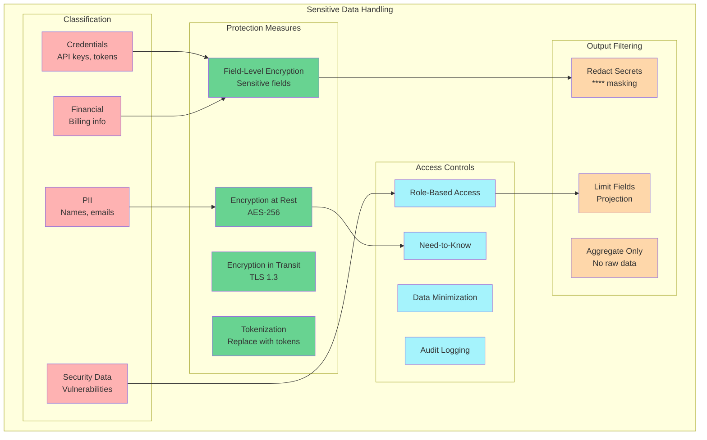

<!-- SVG: 03-mcp-security-model-6.svg -->

## Rate Limiting Architecture

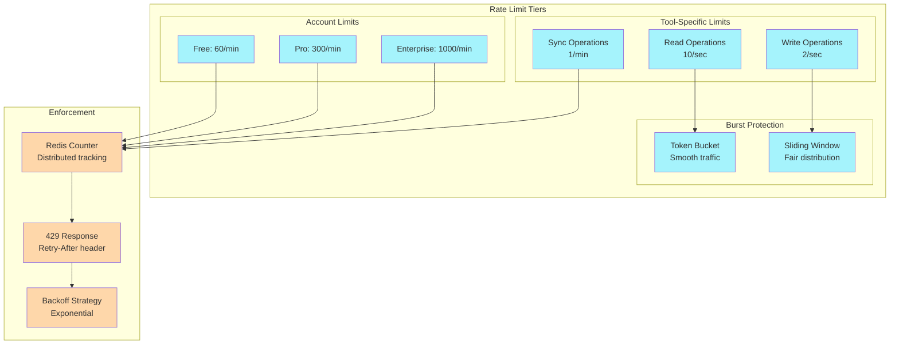

<!-- SVG: 03-mcp-security-model-7.svg -->

## Audit Trail

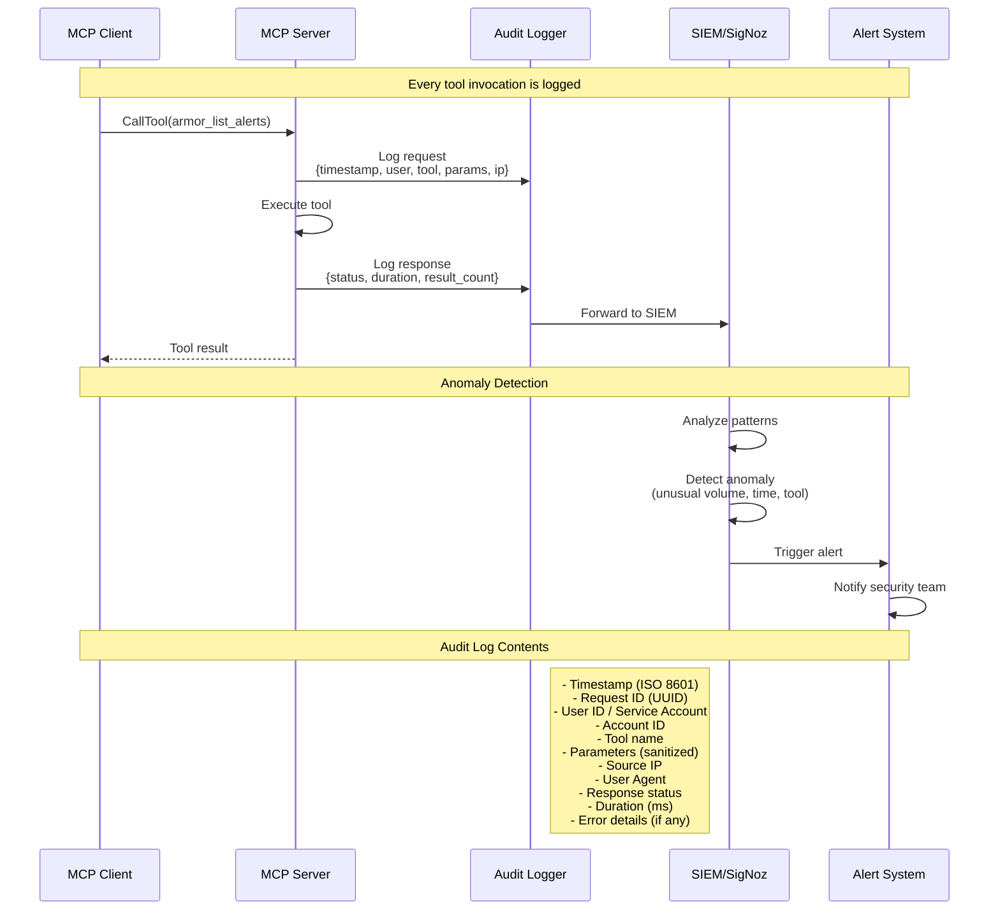

<!-- SVG: 03-mcp-security-model-8.svg -->
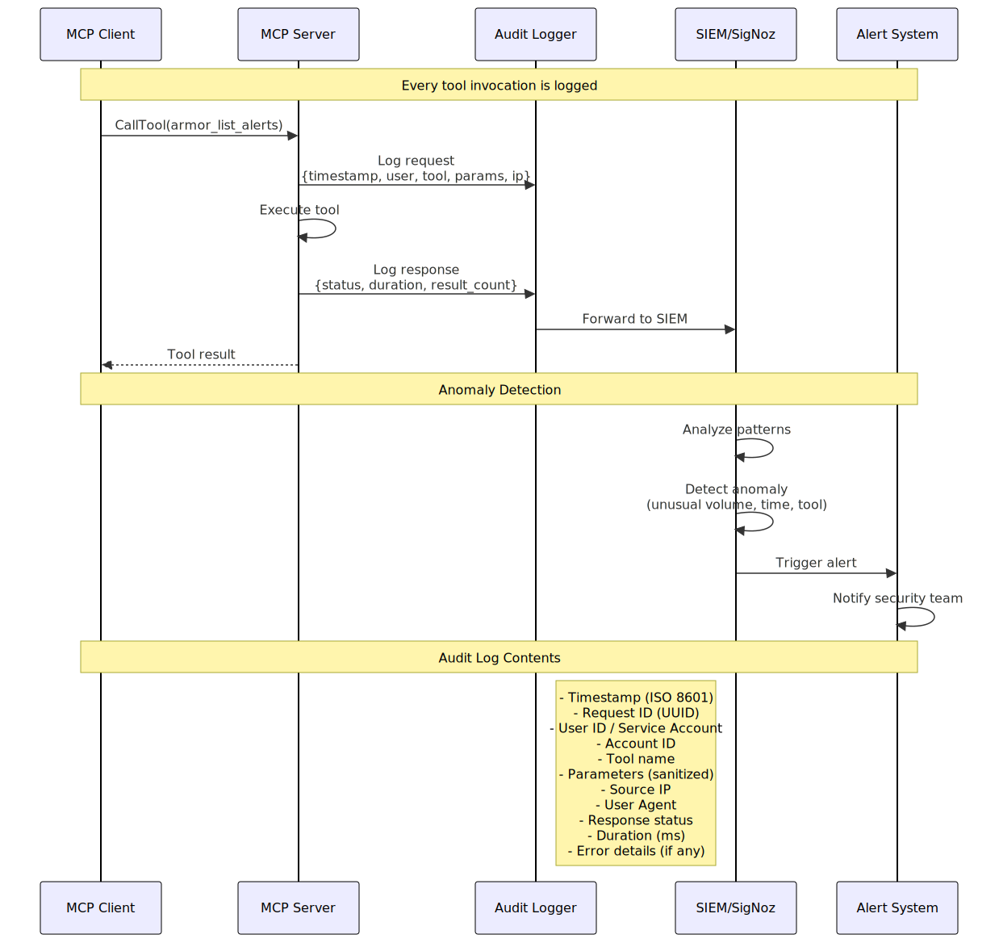

## Secret Management

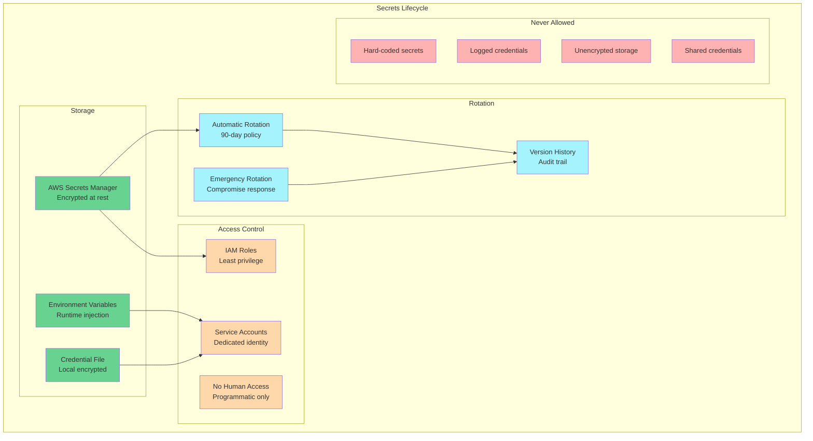

<!-- SVG: 03-mcp-security-model-9.svg -->

## Threat Mitigation Matrix

| Threat | Mitigation | Control |
|--------|------------|---------|
| **Credential Theft** | Client credentials grant, short-lived tokens | OAuth2 |
| **Token Replay** | JWT expiry (1 hour), single-use refresh | Token validation |
| **Privilege Escalation** | RBAC, scope validation, resource-level checks | Authorization |
| **Data Exfiltration** | Field-level access, result limits, audit logging | Data protection |
| **API Abuse** | Rate limiting, burst protection, anomaly detection | Rate limiting |
| **Injection Attacks** | Schema validation, parameterized queries, sanitization | Input validation |
| **Man-in-the-Middle** | TLS 1.3, certificate pinning | Transport security |
| **Insider Threat** | Least privilege, audit trail, anomaly detection | Access control |

## Security Requirements Checklist

### Authentication
- [ ] OAuth2 client credentials flow implemented
- [ ] JWT validation with RS256 signature
- [ ] Token refresh before expiry
- [ ] Secure credential storage (encrypted)
- [ ] No credentials in logs

### Authorization
- [ ] RBAC permission model
- [ ] Scope-based access control
- [ ] Resource-level permissions
- [ ] Permission caching with invalidation

### Input Validation
- [ ] JSON Schema validation for all tools
- [ ] Parameter sanitization
- [ ] Query result limits
- [ ] Injection protection

### Rate Limiting
- [ ] Per-account quotas
- [ ] Per-tool limits
- [ ] Burst protection
- [ ] Retry-After headers

### Audit & Monitoring
- [ ] All tool invocations logged
- [ ] Log forwarding to SIEM
- [ ] Anomaly detection rules
- [ ] Alerting on suspicious activity

### Data Protection
- [ ] Encryption at rest
- [ ] Encryption in transit (TLS 1.3)
- [ ] Sensitive field redaction
- [ ] Data minimization in responses

---

## Related Diagrams

| Category | Diagram | Relationship |
|----------|---------|--------------|
| Architecture | [MCP Integration](../architecture/03-mcp-integration.md) | MCP architecture overview |
| Security | [Auth Flow](./01-auth-flow.md) | OAuth2/OIDC details |
| Security | [RBAC Model](./02-rbac-model.md) | Permission structure |

---

## Related Documentation

- [MCP Server Specification](../../planning-artifacts/20-mcp-server-specification.md) - Full MCP implementation
- [Security & Compliance](../../planning-artifacts/08-security-compliance.md) - Platform security requirements
- [API Developer Experience](../../planning-artifacts/18-api-developer-experience.md) - API security

---

Last Updated: 2026-01-04
Maintained By: Security Team
