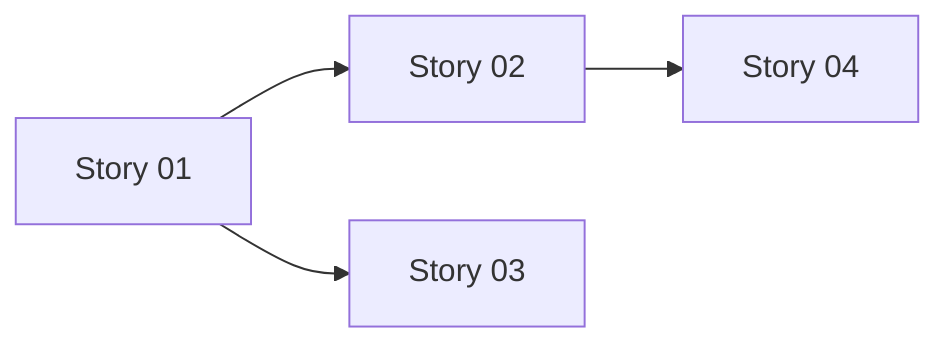

# {{EPIC_ID}}: {{EPIC_TITLE}} - Full Documentation

> **Version:** 1.0
> **Last Updated:** {{DATE}}
> **Status:** {{STATUS}}
> **Owner:** {{OWNER_TEAM}}

---

## Table of Contents

1. [Executive Summary](#executive-summary)
2. [Problem Statement](#problem-statement)
3. [Goals & Success Criteria](#goals--success-criteria)
4. [Architecture](#architecture)
5. [Technical Approach](#technical-approach)
6. [Story Breakdown](#story-breakdown)
7. [Risk Assessment](#risk-assessment)
8. [Dependencies](#dependencies)
9. [Testing Strategy](#testing-strategy)
10. [AI Implementation Guide](#ai-implementation-guide)
11. [Observability](#observability)
12. [Rollback Plan](#rollback-plan)
13. [Appendix](#appendix)

---

## Executive Summary

{{EXECUTIVE_SUMMARY_PARAGRAPH}}

### Key Metrics

| Metric | Target | Current |
|--------|--------|---------|
| {{METRIC_1}} | {{TARGET}} | {{CURRENT}} |
| {{METRIC_2}} | {{TARGET}} | {{CURRENT}} |
| {{METRIC_3}} | {{TARGET}} | {{CURRENT}} |

### Timeline

| Phase | Stories | Target Sprint |
|-------|---------|---------------|
| Phase 1 | {{STORIES}} | Sprint {{N}} |
| Phase 2 | {{STORIES}} | Sprint {{N}} |
| Phase 3 | {{STORIES}} | Sprint {{N}} |

---

## Problem Statement

### Current State

{{CURRENT_STATE_DESCRIPTION}}

### Pain Points

1. **{{PAIN_POINT_1_TITLE}}**: {{DESCRIPTION}}
2. **{{PAIN_POINT_2_TITLE}}**: {{DESCRIPTION}}
3. **{{PAIN_POINT_3_TITLE}}**: {{DESCRIPTION}}

### Impact

- **Users Affected:** {{USER_COUNT_OR_SEGMENT}}
- **Business Cost:** {{COST_DESCRIPTION}}
- **Technical Debt:** {{TECH_DEBT_DESCRIPTION}}

---

## Goals & Success Criteria

### Primary Goals

1. {{GOAL_1}}
2. {{GOAL_2}}
3. {{GOAL_3}}

### Success Criteria

| Criteria | Measurement | Target |
|----------|-------------|--------|
| {{CRITERIA_1}} | {{HOW_MEASURED}} | {{TARGET}} |
| {{CRITERIA_2}} | {{HOW_MEASURED}} | {{TARGET}} |
| {{CRITERIA_3}} | {{HOW_MEASURED}} | {{TARGET}} |

### Non-Goals (Out of Scope)

- {{NON_GOAL_1}}
- {{NON_GOAL_2}}
- {{NON_GOAL_3}}

---

## Architecture

### System Context

```
┌─────────────────────────────────────────────────────────────┐
│                     {{SYSTEM_CONTEXT_DIAGRAM}}               │
└─────────────────────────────────────────────────────────────┘
```

### Component Diagram

```
{{COMPONENT_DIAGRAM_ASCII}}
```

### Data Flow

```
{{DATA_FLOW_DIAGRAM_ASCII}}
```

### Key Design Decisions

| Decision | Rationale | Alternatives Considered |
|----------|-----------|------------------------|
| {{DECISION_1}} | {{RATIONALE}} | {{ALTERNATIVES}} |
| {{DECISION_2}} | {{RATIONALE}} | {{ALTERNATIVES}} |
| {{DECISION_3}} | {{RATIONALE}} | {{ALTERNATIVES}} |

---

## Technical Approach

### Technology Stack

| Layer | Technology | Purpose |
|-------|------------|---------|
| {{LAYER_1}} | {{TECH}} | {{PURPOSE}} |
| {{LAYER_2}} | {{TECH}} | {{PURPOSE}} |
| {{LAYER_3}} | {{TECH}} | {{PURPOSE}} |

### API Design

#### Endpoints

| Method | Path | Purpose |
|--------|------|---------|
| {{METHOD}} | {{PATH}} | {{PURPOSE}} |
| {{METHOD}} | {{PATH}} | {{PURPOSE}} |

#### Request/Response Examples

```json
// {{ENDPOINT_1}} Request
{{REQUEST_EXAMPLE}}

// {{ENDPOINT_1}} Response
{{RESPONSE_EXAMPLE}}
```

### Database Schema

```sql
-- {{TABLE_NAME}}
{{SCHEMA_DDL}}
```

### Security Considerations

1. **Authentication:** {{AUTH_APPROACH}}
2. **Authorization:** {{AUTHZ_APPROACH}}
3. **Data Protection:** {{DATA_PROTECTION}}
4. **Audit Logging:** {{AUDIT_APPROACH}}

---

## Story Breakdown

### Story Map

```
{{EPIC_ID}}
├── 01-{{STORY_1_SLUG}}/ ({{POINTS}} pts)
│   ├── T1: {{TASK_1}}
│   ├── T2: {{TASK_2}}
│   └── T3: {{TASK_3}}
├── 02-{{STORY_2_SLUG}}/ ({{POINTS}} pts)
│   ├── T1: {{TASK_1}}
│   └── T2: {{TASK_2}}
└── 03-{{STORY_3_SLUG}}/ ({{POINTS}} pts)
    ├── T1: {{TASK_1}}
    └── T2: {{TASK_2}}
```

### Story Details

#### Story 01: {{STORY_1_TITLE}}

**Points:** {{POINTS}} | **Sprint:** {{SPRINT}} | **Status:** {{STATUS}}

**Summary:** {{STORY_SUMMARY}}

**Acceptance Criteria:**
- AC-1: {{ACCEPTANCE_CRITERIA_1}}
- AC-2: {{ACCEPTANCE_CRITERIA_2}}

**Tasks:**
1. T1: {{TASK_1_TITLE}}
2. T2: {{TASK_2_TITLE}}
3. T3: {{TASK_3_TITLE}}

---

#### Story 02: {{STORY_2_TITLE}}

**Points:** {{POINTS}} | **Sprint:** {{SPRINT}} | **Status:** {{STATUS}}

**Summary:** {{STORY_SUMMARY}}

**Acceptance Criteria:**
- AC-1: {{ACCEPTANCE_CRITERIA_1}}
- AC-2: {{ACCEPTANCE_CRITERIA_2}}

**Tasks:**
1. T1: {{TASK_1_TITLE}}
2. T2: {{TASK_2_TITLE}}

---

### Dependencies Between Stories



---

## Risk Assessment

### Technical Risks

| Risk | Likelihood | Impact | Mitigation |
|------|------------|--------|------------|
| {{RISK_1}} | {{L/M/H}} | {{L/M/H}} | {{MITIGATION}} |
| {{RISK_2}} | {{L/M/H}} | {{L/M/H}} | {{MITIGATION}} |
| {{RISK_3}} | {{L/M/H}} | {{L/M/H}} | {{MITIGATION}} |

### Business Risks

| Risk | Likelihood | Impact | Mitigation |
|------|------------|--------|------------|
| {{RISK_1}} | {{L/M/H}} | {{L/M/H}} | {{MITIGATION}} |
| {{RISK_2}} | {{L/M/H}} | {{L/M/H}} | {{MITIGATION}} |

### Contingency Plans

1. **If {{CONDITION}}:** {{CONTINGENCY_ACTION}}
2. **If {{CONDITION}}:** {{CONTINGENCY_ACTION}}

---

## Dependencies

### Upstream Dependencies (We Need)

| Dependency | Owner | Status | Risk if Delayed |
|------------|-------|--------|-----------------|
| {{DEPENDENCY_1}} | {{TEAM}} | {{STATUS}} | {{RISK}} |
| {{DEPENDENCY_2}} | {{TEAM}} | {{STATUS}} | {{RISK}} |

### Downstream Dependencies (Need Us)

| Epic/Story | Owner | Blocking Status |
|------------|-------|-----------------|
| {{EPIC/STORY}} | {{TEAM}} | {{STATUS}} |
| {{EPIC/STORY}} | {{TEAM}} | {{STATUS}} |

### External Dependencies

- {{EXTERNAL_DEPENDENCY_1}}
- {{EXTERNAL_DEPENDENCY_2}}

---

## Testing Strategy

### Test Pyramid

| Level | Coverage Target | Tools |
|-------|-----------------|-------|
| Unit Tests | 80%+ | {{UNIT_TEST_FRAMEWORK}} |
| Integration Tests | Key Paths | {{INTEGRATION_FRAMEWORK}} |
| E2E Tests | Critical Flows | Playwright |
| Performance Tests | SLA Validation | k6 |

### Test Scenarios

#### Happy Path Tests

1. {{HAPPY_PATH_1}}
2. {{HAPPY_PATH_2}}
3. {{HAPPY_PATH_3}}

#### Edge Cases

1. {{EDGE_CASE_1}}
2. {{EDGE_CASE_2}}
3. {{EDGE_CASE_3}}

#### Error Scenarios

1. {{ERROR_SCENARIO_1}}
2. {{ERROR_SCENARIO_2}}
3. {{ERROR_SCENARIO_3}}

### Performance Requirements

| Metric | Target | Measurement |
|--------|--------|-------------|
| Response Time (p95) | < {{MS}}ms | SigNoz |
| Throughput | {{RPS}} req/s | k6 |
| Error Rate | < {{PERCENT}}% | SigNoz |

---

## AI Implementation Guide

### Context for AI Agents

```
PLATFORM CONTEXT (memorize this):
━━━━━━━━━━━━━━━━━━━━━━━━━━━━━━━━━━━━━━━
Armor Argus is an autonomous cloud security platform that:
- Replaces visibility-only tools by safely FIXING highest-impact risks
- Uses NebulaGraph for attack path analysis (graph queries)
- Uses ClickHouse for findings, risk scores, events, and audit evidence
- Uses Cedar policy language for deterministic policy enforcement
- Requires SigNoz/OpenTelemetry for all observability

THIS EPIC'S ROLE:
{{EPIC_ROLE_IN_PLATFORM}}

KEY FILES TO REFERENCE:
- {{FILE_PATH_1}} - {{PURPOSE}}
- {{FILE_PATH_2}} - {{PURPOSE}}
- {{FILE_PATH_3}} - {{PURPOSE}}

PATTERNS TO FOLLOW:
- {{PATTERN_1}}
- {{PATTERN_2}}
- {{PATTERN_3}}

ANTI-PATTERNS TO AVOID:
- {{ANTI_PATTERN_1}}
- {{ANTI_PATTERN_2}}
- {{ANTI_PATTERN_3}}
```

### Story-Specific AI Prompts

Each story's README.md contains detailed AI prompts. Key patterns:

1. **Problem Analysis Prompt**: Establishes context
2. **Functional Requirements Prompt**: Exact file paths and patterns
3. **Testing Prompt**: Specific test patterns
4. **Done Checklist Prompt**: Executable verification commands

### Verification Commands

```bash
# Verify all story implementations
{{VERIFICATION_COMMAND_1}}
{{VERIFICATION_COMMAND_2}}
{{VERIFICATION_COMMAND_3}}
```

---

## Observability

### Metrics

| Metric | Type | Labels |
|--------|------|--------|
| `{{METRIC_NAME}}` | {{counter/gauge/histogram}} | {{LABELS}} |
| `{{METRIC_NAME}}` | {{counter/gauge/histogram}} | {{LABELS}} |

### Traces

Key spans to instrument:
- `{{SPAN_1}}`: {{PURPOSE}}
- `{{SPAN_2}}`: {{PURPOSE}}

### Logs

| Event | Level | Fields |
|-------|-------|--------|
| {{EVENT}} | {{INFO/WARN/ERROR}} | {{FIELDS}} |
| {{EVENT}} | {{INFO/WARN/ERROR}} | {{FIELDS}} |

### Alerts

| Alert | Condition | Severity | Runbook |
|-------|-----------|----------|---------|
| {{ALERT_NAME}} | {{CONDITION}} | {{P1/P2/P3}} | {{RUNBOOK_LINK}} |
| {{ALERT_NAME}} | {{CONDITION}} | {{P1/P2/P3}} | {{RUNBOOK_LINK}} |

### Dashboards

- **{{DASHBOARD_1}}**: {{PURPOSE}}
- **{{DASHBOARD_2}}**: {{PURPOSE}}

---

## Rollback Plan

### Rollback Triggers

- {{TRIGGER_1}}
- {{TRIGGER_2}}
- {{TRIGGER_3}}

### Rollback Steps

1. {{STEP_1}}
2. {{STEP_2}}
3. {{STEP_3}}

### Data Migration Rollback

{{DATA_ROLLBACK_APPROACH}}

### Feature Flag Strategy

- **Flag Name:** `{{FLAG_NAME}}`
- **Default:** {{ON/OFF}}
- **Rollout:** {{ROLLOUT_PERCENTAGE}}%

---

## Appendix

### Glossary

| Term | Definition |
|------|------------|
| {{TERM}} | {{DEFINITION}} |
| {{TERM}} | {{DEFINITION}} |

### References

- [{{REFERENCE_1}}]({{URL}})
- [{{REFERENCE_2}}]({{URL}})

### Change Log

| Date | Version | Changes |
|------|---------|---------|
| {{DATE}} | 1.0 | Initial epic documentation |

---

**Synced to Confluence:** [{{EPIC_ID}}: {{EPIC_TITLE}}]({{CONFLUENCE_URL}})
